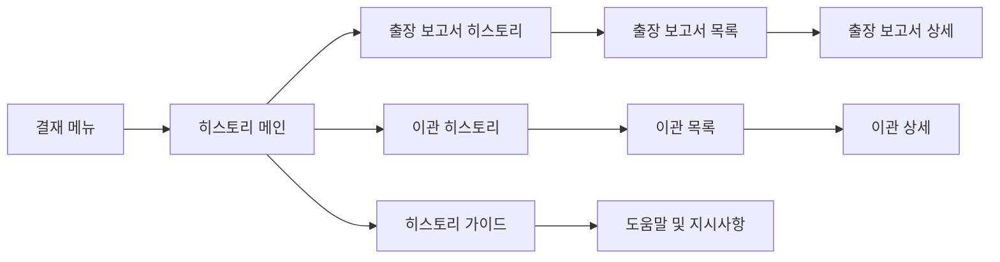

# 결재 히스토리 워크플로우 - 페이지 분석

## 📍 페이지 개요
- **Page Name**: 결재 히스토리 워크플로우
- **Primary Purpose**: 결재 문서, 출장 보고서 및 이관 기록의 히스토리 추적 및 보고
- **User Journey**: 사용자가 보고, 감사 및 참조 목적으로 결재 히스토리 데이터에 접근

## 🛤️ 라우터 구성

### Route Paths
- **Base Route**: `/approval-history`
- **Guide Route**: `/approval-history/guide`
- **Trip Report Route**: `/approval-history/trip-report`
- **Transfer Route**: `/approval-history/transfer`

### Route Parameters
- 현재 정의된 동적 라우트 매개변수 없음
- 향후 확장에는 날짜 범위, 보고서 ID 또는 사용자 필터가 포함될 수 있음

## 🏗️ 페이지 아키텍처

```
ApprovalHistoryWorkflow
├── HistoryMainPage (/history)
│   └── 기본 히스토리 컨테이너 (최소 구현)
├── HistoryGuidePage (/guide)
│   ├── IconClick
│   ├── HwText (지시사항)
│   └── Description Content
├── TripReportPage (/trip-report)
│   ├── ResponsiveWrapper
│   │   ├── HistoryTripReportMo
│   │   └── HistoryTripReportPc
│   ├── Trip Report Form Components
│   │   ├── Form Validation
│   │   ├── Data Types
│   │   └── Mock Data Integration
│   └── History Display Components
└── TransferPage (/transfer)
    ├── ResponsiveWrapper
    │   ├── HistoryTransferMo
    │   └── HistoryTransferPc
    ├── Transfer Record Components
    │   ├── Form Validation
    │   ├── Data Types
    │   └── Mock Data Integration
    └── Transfer History Display
```

## 📦 컴포넌트 매핑

| Component | Location | Purpose | Props | Events |
|-----------|----------|---------|-------|--------|
| History | `/history/index.tsx` | 메인 히스토리 페이지 (최소) | 없음 | 기본 컨테이너 |
| ApprovalGuidePage | `/history/guide/index.tsx` | 히스토리 가이드 및 지시사항 | 없음 | 도움말 콘텐츠 표시 |
| HistoryTripReportPage | `/history/tripReport/index.tsx` | 출장 보고서 히스토리 메인 | 없음 | 컴포넌트 래퍼 |
| HistoryTripReportMo | `/history/tripReport/tripReportMo.tsx` | 모바일 출장 보고서 보기 | Report data | 출장 보고서 상호작용 |
| HistoryTripReportPc | `/history/tripReport/tripReportPc.tsx` | 데스크톱 출장 보고서 보기 | Report data | 출장 보고서 상호작용 |
| HistoryTransferPage | `/history/transfer/index.tsx` | 이관 히스토리 메인 | mockTransferData | 이관 히스토리 표시 |
| HistoryTransferMo | `/history/transfer/transferMo.tsx` | 모바일 이관 보기 | Transfer data | 이관 상호작용 |
| HistoryTransferPc | `/history/transfer/transferPc.tsx` | 데스크톱 이관 보기 | Transfer data | 이관 상호작용 |

## 🔄 데이터 흐름

### Data Sources
- **Mock Data**: 이관 히스토리를 위한 `mockTransferData`
- **Trip Report Data**: 출장 보고를 위한 구조화된 데이터 타입
- **Form Validation**: 데이터 무결성을 위한 유효성 검사 스키마
- **Component State**: 히스토리 필터링 및 표시를 위한 로컬 상태 관리

### State Management
- **Local Component State**: 히스토리 필터링, 날짜 범위, 검색어
- **Mock Data Integration**: 개발을 위한 구조화된 mock 데이터
- **Form State**: 검색 및 필터 양식을 위한 React Hook Form 통합

### Data Transformation
- 이관 데이터 처리 및 포맷팅
- 출장 보고서 데이터 구조화
- 날짜 포맷팅 및 로컬라이제이션
- 히스토리 데이터 집계 및 표시

## ⚡ 페이지 기능

- [x] **출장 보고서 히스토리**: 히스토리 출장 보고서 추적 및 표시
- [x] **이관 히스토리**: 이관 기록 관리 및 보기
- [x] **반응형 디자인**: 모바일 및 데스크톱 최적화 레이아웃
- [x] **가이드 섹션**: 도움말 및 지시사항 콘텐츠
- [ ] **날짜 범위 필터링**: 날짜 범위별 히스토리 필터링
- [ ] **검색 기능**: 히스토리 기록 검색
- [ ] **내보내기 기능**: 히스토리 데이터를 다양한 형식으로 내보내기
- [ ] **고급 필터링**: 다중 기준 필터링 옵션
- [ ] **데이터 시각화**: 히스토리 트렌드를 위한 차트 및 그래프
- [ ] **감사 추적**: 완전한 결재 감사 추적

## 🔌 API 통합

| Endpoint | Method | Purpose | Trigger | Status |
|----------|--------|---------|---------|--------|
| Trip Report History | GET | 출장 보고서 기록 조회 | 페이지 로드 | 구현되지 않음 |
| Transfer History | GET | 이관 기록 조회 | 페이지 로드 | Mock Data |
| History Search | GET | 히스토리 기록 검색 | 검색 양식 제출 | 구현되지 않음 |
| Export History | GET | 히스토리 데이터 내보내기 | 내보내기 버튼 클릭 | 구현되지 않음 |

### Data Types and Validation

#### Trip Report Structure
```typescript
// 출장 보고서 데이터 타입 (types.ts에서)
interface TripReportData {
  // 출장 보고서 특정 필드
  // validation.ts에서 정의된 유효성 검사 스키마
}
```

#### Transfer Structure
```typescript
// 이관 데이터 타입 (types.ts에서)  
interface TransferData {
  // 이관 특정 필드
  // data.ts에서 정의된 Mock 데이터
}
```

## 🎨 UI/UX 요소

### Layout Type
- **반응형 레이아웃**: 모바일 및 데스크톱 컴포넌트 변형
- **단순 컨테이너**: 최소한의 메인 히스토리 페이지
- **가이드 레이아웃**: 아이콘 및 텍스트가 있는 지시사항 콘텐츠

### Loading States
- 히스토리 데이터 조회를 위한 컴포넌트 로딩
- 양식 제출 로딩 상태

### Error States
- 히스토리 데이터 없음 메시지
- 검색 결과 오류 처리
- 데이터 로딩 오류 표시

### Empty States
- 출장 보고서 없음
- 빈 이관 히스토리
- 검색 결과 없음 안내

## 🔐 권한 및 보안

### Authentication Required
- ✅ 히스토리 접근을 위한 사용자 인증 필요
- ✅ 사용자 권한에 따른 히스토리 데이터 접근

### Data Privacy
- 히스토리 데이터 접근 제한
- 사용자별 히스토리 필터링
- 감사 로그 보호 및 접근 제어

### Data Validation
- 출장 보고서 데이터 유효성 검사 스키마
- 이관 기록 유효성 검사
- 검색 매개변수 무결성 검사

## 📱 네비게이션 흐름



## 🧩 컴포넌트 의존성

```
History Workflow Dependencies
├── Shared Components
│   ├── ResponsiveWrapper
│   ├── HwText Components
│   └── Chakra UI Layout
├── Form Components
│   ├── Form Validation Schemas
│   ├── Data Type Definitions
│   └── Mock Data Integration
├── UI Components
│   ├── IconClick
│   ├── Box, Flex Components
│   └── Custom History Display Components
└── Data Management
    ├── Mock Data Files
    ├── Type Definitions
    └── Validation Schemas
```

## 📋 주요 기능 요약

### 1. **출장 보고서 히스토리**
- **히스토리 추적**: 시간에 따른 출장 보고서 제출 추적
- **모바일/데스크톱 보기**: 반응형 출장 보고서 표시
- **데이터 유효성 검사**: 출장 보고서를 위한 구조화된 데이터 유효성 검사
- **양식 통합**: 출장 보고서 양식 처리 및 유효성 검사

### 2. **이관 히스토리**
- **이관 기록**: 히스토리 이관 문서 추적
- **Mock Data Integration**: 개발 준비된 mock 이관 데이터
- **반응형 표시**: 모바일 및 데스크톱 이관 기록 보기
- **데이터 처리**: 이관 데이터 포맷팅 및 표시

### 3. **가이드 및 도움말**
- **사용자 지시사항**: 히스토리 기능에 대한 포괄적인 가이드
- **시각적 안내**: 아이콘 기반 지시사항 표시
- **국제화**: 지시사항을 위한 다국어 지원

### 4. **개발 인프라**
- **타입 안전성**: 모든 데이터 구조에 대한 TypeScript 인터페이스
- **Mock Data**: 개발을 위한 포괄적인 mock 데이터
- **유효성 검사 스키마**: 양식 및 데이터 유효성 검사 프레임워크
- **컴포넌트 아키텍처**: 모듈형, 재사용 가능한 컴포넌트 구조

## ⚙️ 기술 구현

### Component Structure
```typescript
// 반응형 래퍼 패턴
const HistoryTripReportPage = () => {
  return (
    <ResponsiveWrapper 
      mobileComponent={<HistoryTripReportMo />} 
      desktopComponent={<HistoryTripReportPc />} 
    />
  )
}
```

### Mock Data Integration
```typescript
// mock 데이터가 있는 이관 히스토리
const HistoryTransferPage = () => {
  return (
    <ResponsiveWrapper
      mobileComponent={<HistoryTransferMo data={mockTransferData} />}
      desktopComponent={<HistoryTransferPc data={mockTransferData} />}
    />
  )
}
```

### Data Types and Validation
- **구조화된 타입**: 모든 히스토리 데이터에 대한 TypeScript 인터페이스
- **유효성 검사 스키마**: 히스토리 검색 및 필터링을 위한 양식 유효성 검사
- **Mock Data**: 테스트를 위한 개발 준비 데이터셋

### Future Enhancement Areas

#### 1. **고급 필터링 및 검색**
```typescript
interface HistoryFilterOptions {
  dateRange: { start: Date; end: Date }
  documentType: string[]
  status: string[]
  userFilter: string
  departmentFilter: string[]
}
```

#### 2. **데이터 내보내기 기능**
```typescript
interface ExportOptions {
  format: 'csv' | 'excel' | 'pdf'
  dateRange: DateRange
  includeDetails: boolean
  filterCriteria: HistoryFilterOptions
}
```

#### 3. **데이터 시각화**
```typescript
interface HistoryChartData {
  approvalTrends: TimeSeriesData[]
  documentTypeCounts: CategoryData[]
  departmentActivity: CategoryData[]
  statusDistribution: PieChartData[]
}
```

## 현재 구현 상태

### ✅ 구현된 기능
- 기본 히스토리 페이지 구조
- 반응형 컴포넌트 아키텍처  
- 출장 보고서 및 이관 히스토리 컴포넌트
- 지시사항이 있는 가이드 페이지
- 이관을 위한 Mock 데이터 통합
- 타입 정의 및 유효성 검사 스키마

### 🚧 개발 중
- 출장 보고서 히스토리 데이터 통합
- 고급 필터링 기능
- 검색 기능

### 📋 향후 개선사항
- 데이터 시각화 및 차트
- 내보내기 기능
- 고급 감사 추적
- 실시간 히스토리 업데이트
- 대용량 데이터셋을 위한 성능 최적화

이 히스토리 워크플로우는 시스템이 발전함에 따라 고급 기능을 지원할 수 있는 확장 가능한 아키텍처로 포괄적인 결재 히스토리 추적을 위한 기반을 제공합니다.