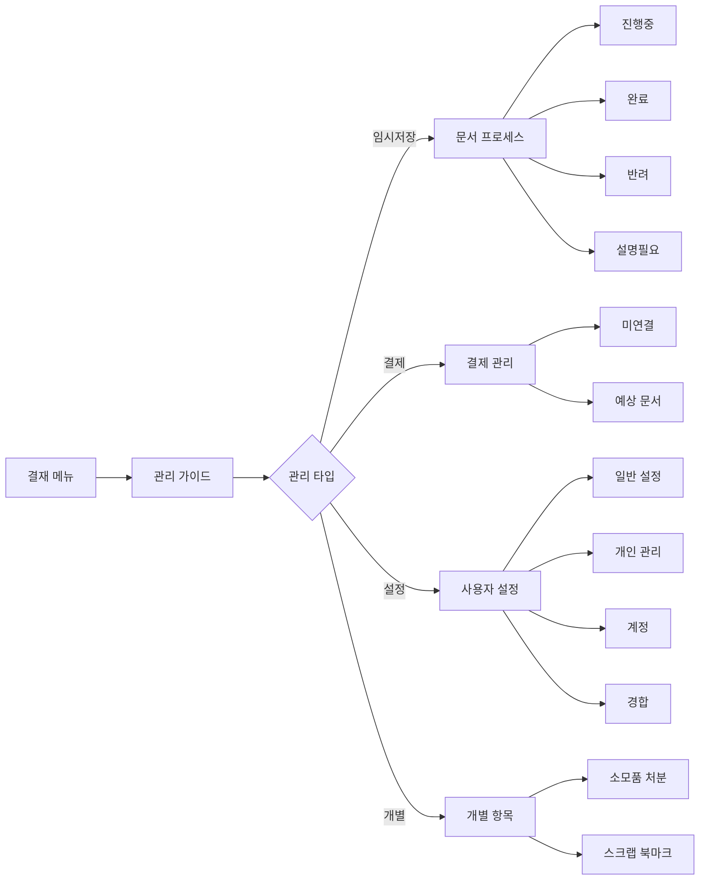

# 결재 관리 워크플로우 - 페이지 분석

## 📍 페이지 개요
- **Page Name**: 결재 관리 워크플로우
- **Primary Purpose**: 결재 시스템을 위한 문서 관리, 처리 및 사용자 설정
- **User Journey**: 사용자가 임시저장 문서 관리, 결재 프로세스 보기, 결제 처리, 사용자 설정 구성

## 🛤️ 라우터 구성

### Route Paths
- **Base Route**: `/approval-management`
- **Guide Route**: `/approval-management/guide`
- **Need Approval**: `/approval-management/need`
- **Payment Routes**:
  - `/approval-management/payment/unconnected`
  - `/approval-management/payment/expected-document`
  - `/approval-management/payment/unconnected/detail/:id`
- **Draft Document Routes**:
  - `/approval-management/drafts/document-processing`
  - `/approval-management/drafts/document-completed`
  - `/approval-management/drafts/document-rejected`
  - `/approval-management/drafts/document-need-explanation`
  - `/approval-management/drafts/document-related`
  - `/approval-management/drafts/document-line`
  - `/approval-management/drafts/document-line/:id`
  - `/approval-management/drafts/document-detail/:id`
- **User Settings Routes**:
  - `/approval-management/user-settings/settings`
  - `/approval-management/user-settings/personal-management`
  - `/approval-management/user-settings/account`
  - `/approval-management/user-settings/competition`
- **Individual Routes**:
  - `/approval-management/individual/consumables-disposal`
  - `/approval-management/individual/scrap-book-mark`

### Route Parameters
- `:id` - 상세 보기를 위한 문서/항목 식별자
- `processStatus` - 현재 결재 프로세스 상태 (processing, completed, rejected, need-explanation)

## 🏗️ 페이지 아키텍처

```
ApprovalManagementWorkflow
├── GuidePage (/guide)
│   └── 지시사항 및 도움말 콘텐츠
├── DraftDocumentManagement
│   ├── ApprovalDraftsProcess
│   │   ├── ProcessStatusTabs
│   │   ├── DocumentList
│   │   ├── SearchFilters
│   │   └── PaginationControls
│   └── DocumentDetails
│       ├── DocumentInformation
│       ├── ApprovalLine
│       └── RelatedDocuments
├── PaymentManagement
│   ├── UnconnectedPayments
│   │   ├── UnconnectedMo/Pc
│   │   └── PaymentDetails
│   └── ExpectedDocuments
│       ├── ExpectedDocumentMo/Pc
│       └── DocumentList
├── NeedApprovalSection
│   ├── ApprovalNeedMo/Pc
│   └── NeedDetails
├── UserSettingsSection
│   ├── GeneralSettings
│   ├── PersonalManagement
│   ├── AccountSettings
│   └── CompetitionSettings
└── IndividualSection
    ├── ConsumablesDisposal
    └── ScrapBookmark
```

## 📦 컴포넌트 매핑

| Component | Location | Purpose | Props | Events |
|-----------|----------|---------|-------|--------|
| ApprovalDraftsProcess | `/management/drafts/index.tsx` | 메인 임시저장 처리 페이지 | processStatus | 문서 탐색, 필터링 |
| ApprovalDraftsProcessMo | `/management/drafts/draftProcessMo.tsx` | 모바일 임시저장 처리 | processStatus | 탭 전환, 문서 선택 |
| ApprovalDraftsProcessPc | `/management/drafts/draftProcessPc.tsx` | 데스크톱 임시저장 처리 | processStatus | 탭 전환, 문서 선택 |
| DocumentDetails | `/management/drafts/details/index.tsx` | 문서 상세 보기 | document data | 문서 세부사항 보기/편집 |
| ApprovalNeedPage | `/management/need/index.tsx` | 결재 필요 문서 | mockNeedData | 결재 액션 |
| UnconnectedPayment | `/management/payment/unconnected/index.tsx` | 미연결 결제 | payment data | 결제 처리 |
| ExpectedDocument | `/management/payment/expectedDocument/index.tsx` | 예상 문서 | document data | 문서 추적 |
| UserSettings | `/management/userSettings/settings/index.tsx` | 사용자 환경설정 | settings data | 설정 업데이트 |
| PersonalManagement | `/management/userSettings/personalManagement/index.tsx` | 개인 결재 설정 | personal data | 결재선 관리 |
| AccountSettings | `/management/userSettings/account/index.tsx` | 계정 관리 | account data | 계정 업데이트 |
| CompetitionSettings | `/management/userSettings/competition/index.tsx` | 경합 설정 | competition data | 경합 관리 |
| ConsumablesDisposal | `/management/individual/consumableDisposal/index.tsx` | 소모품 처분 | disposal data | 처분 액션 |
| ScrapBookmark | `/management/individual/scrapBookMark/index.tsx` | 스크랩 북마크 | bookmark data | 북마크 관리 |

## 🔄 데이터 흐름

### Data Sources
- **Mock Data**: 현재 대부분의 기능에 mock 데이터 사용
- **API Integration**: 향후 API 연결을 위한 hooks 준비
- **Store**: 문서 상태 및 패널 관리를 위한 결재 store
- **Local Storage**: 이전 페이지 추적 및 사용자 환경설정

### State Management
- **useApprovalStore**: 글로벌 결재 상태 관리
- **useMobileLayoutStore**: 모바일 레이아웃 및 패널 관리
- **React Hook Form**: 검색 및 설정을 위한 양식 상태
- **Local State**: 페이지네이션, 탭 선택, 모달 상태

### Data Transformation
- 결재 프로세스 단계 기반 문서 상태 필터링
- 미연결 및 예상 문서를 위한 결제 데이터 처리
- 사용자 설정 데이터 유효성 검사 및 포맷팅

## ⚡ 페이지 기능

- [x] **문서 프로세스 관리**: 상태별 문서 추적 (진행중, 완료, 반려, 설명필요)
- [x] **검색 및 필터**: 날짜 범위, 검색 필드, 문서 타입 필터링
- [x] **페이지네이션**: 페이지네이션 컨트롤로 대용량 데이터셋 처리
- [x] **탭 네비게이션**: 상태 기반 문서 조직
- [x] **문서 상세**: 결재 이력이 포함된 상세 문서 보기
- [x] **결제 관리**: 미연결 결제 및 예상 문서 처리
- [x] **사용자 설정**: 포괄적인 사용자 환경설정 관리
- [x] **반응형 디자인**: 모바일 및 데스크톱 최적화 레이아웃
- [x] **모달 통합**: 상세 보기를 위한 팝업 콘텐츠
- [ ] **실시간 업데이트**: 라이브 문서 상태 업데이트
- [ ] **대량 액션**: 다중 문서 작업
- [ ] **고급 필터링**: 복잡한 필터 조합

## 🔌 API 통합

| Endpoint | Method | Purpose | Trigger | Status |
|----------|--------|---------|---------|--------|
| Document Process List | GET | 상태별 문서 조회 | 페이지 로드, 탭 변경 | Mock Data |
| Document Details | GET | 문서 정보 가져오기 | 문서 클릭 | Mock Data |
| Payment Unconnected | GET | 미연결 결제 가져오기 | 페이지 로드 | Mock Data |
| Expected Documents | GET | 예상 문서 가져오기 | 페이지 로드 | Mock Data |
| Need Approval List | GET | 결재 필요 문서 가져오기 | 페이지 로드 | Mock Data |
| User Settings | GET/PUT | 사용자 설정 가져오기/업데이트 | 페이지 로드, 저장 | Mock Data |
| Account Management | GET/PUT | 계정 정보 가져오기/업데이트 | 페이지 로드, 저장 | Mock Data |

### Mock Data Examples
```typescript
// 임시저장 프로세스 상태 타입
enum ApprovalProcessStatus {
  PROCESSING = 'document-processing',
  COMPLETED = 'document-completed',
  REJECTED = 'document-rejected',
  NEED_EXPLANATION = 'document-need-explanation'
}

// 문서 인터페이스
interface ApprovalProcessDocument {
  id: string
  documentType: string
  documentTitle: string
  draftDate: string
  approvalDate: string
  draftDept: string
  drafter: string
  nextApprover: string
  finalApprover: string
  summary: string
  documentStatus: string
  documentNumber: string
}
```

## 🎨 UI/UX 요소

### Layout Type
- **탭 기반 네비게이션**: 프로세스 상태 탭
- **마스터-디테일 패턴**: 디테일 패널이 있는 목록 보기
- **반응형 그리드**: 다양한 화면 크기에 적응형 레이아웃

### Loading States
- 네비게이션 중 문서 목록 로딩
- 검색 결과 로딩 표시기
- 양식 제출 로딩 상태

### Error States
- 문서 없음 메시지
- API 오류 처리
- 양식 유효성 검사 오류

### Empty States
- 도움말 메시지가 있는 빈 문서 목록
- 검색 결과 없음 안내
- 빈 결제 큐

### Animations
- 탭 전환 애니메이션
- 모달 입장/퇴장 효과
- 로딩 스피너 및 진행률 표시기

## 🔐 권한 및 보안

### Authentication Required
- ✅ 모든 관리 기능에 완전한 인증 필요
- ✅ 다양한 관리 섹션에 대한 직원 역할 기반 접근

### Role-based Access
- 사용자 역할에 따른 문서 관리 접근
- 결제 관리 권한
- 사용자 설정 수정 권한

### Data Validation
- 모든 설정에 대한 양식 입력 유효성 검사
- 문서 데이터 무결성 검사
- 검색 매개변수 유효성 검사

## 📱 네비게이션 흐름



## 🧩 컴포넌트 의존성

```
Management Workflow Dependencies
├── Shared Components
│   ├── ResponsiveWrapper
│   ├── BackButtonMo
│   ├── SearchBar Components
│   └── Pagination Controls
├── Approval Components
│   ├── Document Process Cards
│   ├── Approval Line Components
│   └── Status Indicators
├── Form Components
│   ├── React Hook Form Integration
│   ├── Date Picker Components
│   └── Select Components
├── UI Kit Components
│   ├── HwText, HwInput Components
│   ├── Modal/Popup Components
│   └── Button Components
└── Store Integration
    ├── Approval Store
    ├── Mobile Layout Store
    └── Auth Store
```

## 📋 주요 기능 요약

### 1. **문서 프로세스 관리**
- **상태 추적**: 진행중, 완료, 반려, 설명필요
- **탭 네비게이션**: 문서 상태 간 쉬운 전환
- **검색 및 필터**: 날짜 범위, 문서 타입, 검색어 필터링
- **문서 상세**: 포괄적인 문서 정보 보기
- **결재선**: 결재 워크플로우의 시각적 표현

### 2. **결제 관리**
- **미연결 결제**: 문서에 연결되지 않은 결제 처리
- **예상 문서**: 처리 예정 문서 추적
- **결제 상세**: 상세한 결제 정보 및 액션
- **상태 업데이트**: 결제 처리 상태 추적

### 3. **사용자 설정 관리**
- **일반 설정**: 사용자 환경설정 및 표시 옵션
- **개인 관리**: 결재선 및 위임 설정
- **계정 관리**: 사용자 계정 정보 업데이트
- **경합 설정**: 경합 및 이해충돌 관리

### 4. **개별 항목 관리**
- **소모품 처분**: 소모품 아이템 처분 추적 및 관리
- **스크랩 북마크**: 스크랩 및 북마크 항목 관리
- **개별 액션**: 항목별 특정 액션 및 워크플로우

### 5. **고급 UI 기능**
- **반응형 디자인**: 모바일 및 데스크톱 모두에 최적화
- **모달 통합**: 상세 보기를 위한 팝업 콘텐츠
- **페이지네이션**: 대용량 데이터셋의 효율적인 처리
- **실시간 검색**: 사용자 타이핑에 따른 라이브 검색 결과

## ⚙️ 기술 구현

### State Management Pattern
```typescript
// 결재 상태 관리
const { setSelectedItem, setPanelMode } = useApprovalStore()

// 모바일 레이아웃 관리
const { setCurrentPanel } = useMobileLayoutStore()

// 이전 페이지 추적
saveToStorage(PREVIOUS_PAGE_KEY, location.pathname)
```

### Tab Management
```typescript
const tabs = [
  { key: ApprovalProcessStatus.PROCESSING, label: '진행중' },
  { key: ApprovalProcessStatus.COMPLETED, label: '완료' },
  { key: ApprovalProcessStatus.REJECTED, label: '반려' },
  { key: ApprovalProcessStatus.NEED_EXPLANATION, label: '설명필요' }
]
```

### Responsive Implementation
- 모바일 및 PC 컴포넌트 변형
- 다양한 화면 크기에 적응형 UI 패턴
- 모바일 장치를 위한 터치 최적화 상호작용

### Mock Data Integration
- 개발 및 테스트를 위한 구조화된 mock 데이터
- 모든 데이터 구조에 대한 타입 안전 인터페이스
- 실제 API 통합으로의 쉬운 전환 경로

이 관리 워크플로우는 견고한 상태 관리, 반응형 디자인 및 향후 개선을 위한 확장 가능한 아키텍처로 결재 시스템 내에서 포괄적인 문서 및 사용자 관리 기능을 제공합니다.