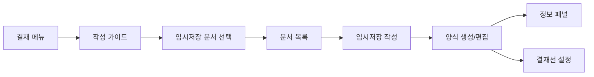

# 결재 작성 워크플로우 - 페이지 분석

## 📍 페이지 개요
- **Page Name**: 결재 작성 워크플로우
- **Primary Purpose**: 결재 시스템을 위한 문서 생성 및 임시저장 작성 인터페이스
- **User Journey**: 사용자가 메인 결재 메뉴에서 접근하여 새 문서나 임시저장을 생성

## 🛤️ 라우터 구성

### Route Paths
- **Base Route**: `/approval-write` 
- **Guide Route**: `/approval-write/guide`
- **Draft Document Route**: `/approval-write/draft-document`
- **Draft Writing Route**: `/approval-write/draft-writing`
- **Draft Writing Information**: `/approval-write/draft-writing/:id`
- **Draft Writing Create**: `/approval-write/draft-writing/create`
- **Draft Writing Template**: `/approval-write/draft-writing/template`
- **Draft Writing Document**: `/approval-write/draft-writing/document`

### Route Parameters
- `:id` - 기존 문서 편집을 위한 문서/임시저장 식별자
- `formClassifyId` - 분류별 양식 필터링을 위한 쿼리 매개변수

## 🏗️ 페이지 아키텍처

```
ApprovalWriteWorkflow
├── GuideePage (/guide)
│   ├── IconClick
│   ├── HwText (지시사항)
│   └── Description Content
├── DraftDocumentPage (/draft-document)
│   ├── ResponsiveWrapper
│   │   ├── DraftDocumentMo (Mobile)
│   │   └── DraftDocumentPc (Desktop)
│   ├── BackButtonMo
│   ├── SearchForm (Filter)
│   └── DocumentList
│       ├── DocumentListBookmarked
│       └── DocumentItem
└── DraftWritingPage (/draft-writing)
    ├── ResponsiveWrapper
    │   ├── DraftWritingMo
    │   └── DraftWritingPc
    ├── InformationSection
    │   ├── InformationMo
    │   └── InformationPc
    └── FormSection
        ├── FormMo
        ├── FormPc
        └── InformationTable
```

## 📦 컴포넌트 매핑

| Component | Location | Purpose | Props | Events |
|-----------|----------|---------|-------|--------|
| DraftDocumentPage | `/write/draftDocument/index.tsx` | 메인 문서 선택 페이지 | dataFavourite, data, search functions | onSearch, onAddFavourite, onDeleteFavourite |
| DraftDocumentMo | `/write/draftDocument/drafDocumentMo.tsx` | 모바일 문서 선택 | 부모와 동일 | 양식 검색, 문서 선택 |
| DraftDocumentPc | `/write/draftDocument/draftDocumentPc.tsx` | 데스크톱 문서 선택 | 부모와 동일 | 양식 검색, 문서 선택 |
| DocumentList | `/write/draftDocument/components/documentList.tsx` | 문서 목록 렌더러 | data, callbacks | 문서 선택, 북마크 토글 |
| DocumentListBookmarked | `/write/draftDocument/components/documentListBookmarked.tsx` | 북마크된 양식 목록 | dataFavourite | 즐겨찾기 관리 |
| DocumentItem | `/write/draftDocument/components/documentItem.tsx` | 개별 문서 항목 | form data, callbacks | 선택을 위한 클릭, 북마크 토글 |
| DraftWritingPage | `/write/draftWriting/index.tsx` | 임시저장 작성 메인 페이지 | mockData | 임시저장 생성/편집 |
| DraftWritingMo | `/write/draftWriting/draftWritingMo.tsx` | 모바일 임시저장 작성 | data | 임시저장 양식 상호작용 |
| DraftWritingPc | `/write/draftWriting/draftWritingPc.tsx` | 데스크톱 임시저장 작성 | data | 임시저장 양식 상호작용 |
| FormSection | `/write/draftWriting/form/index.tsx` | 문서 양식 영역 | form data | 양식 유효성 검사, 제출 |
| InformationSection | `/write/draftWriting/information/index.tsx` | 문서 정보 | document metadata | 정보 표시/편집 |

## 🔄 데이터 흐름

### Data Sources
- **API**: `useFormClassifyList` hook을 통한 양식 분류 목록
- **Store**: 선택된 항목 및 패널 모드를 위한 결재 store
- **Local State**: 검색 매개변수, 양식 데이터, 페이지네이션

### State Management
- **useApprovalStore**: 글로벌 결재 상태 (선택된 항목, 패널 모드)
- **useFormClassifyList**: 양식 분류 및 관심도 관리
- **useHwSearchParams**: URL 검색 매개변수 처리
- **React Hook Form**: 검색 및 임시저장 생성을 위한 양식 상태 관리

### Data Transformation
- 관심도 상태(북마크됨/북마크 안됨)와 결합된 양식 목록 데이터
- 임시저장 작성 기능을 위한 Mock 데이터 사용
- 정보 표시를 위한 문서 메타데이터 처리

## ⚡ 페이지 기능

- [x] **양식 선택**: 문서 템플릿 탐색 및 선택
- [x] **검색/필터링**: 이름, 날짜, 분류별 양식 검색
- [x] **북마크 관리**: 즐겨찾기 양식 추가/제거
- [x] **임시저장 생성**: 새 문서 임시저장 생성
- [x] **임시저장 편집**: 기존 임시저장 문서 편집
- [x] **반응형 디자인**: 모바일 및 데스크톱 레이아웃
- [x] **양식 유효성 검사**: 임시저장 문서를 위한 입력 유효성 검사
- [ ] **파일 업로드**: 문서 첨부 기능
- [ ] **실시간 협업**: 다중 사용자 편집
- [ ] **자동 저장**: 자동 임시저장 기능

## 🔌 API 통합

| Endpoint | Method | Purpose | Trigger | Hook |
|----------|--------|---------|---------|------|
| Form Classification List | GET | 사용 가능한 양식 조회 | 페이지 로드, 검색 | `useApprovalMyFormInterestList` |
| Create Form Interest | POST | 즐겨찾기에 양식 추가 | 북마크 클릭 | `useApprovalCreateFormInterest` |
| Delete Form Interest | DELETE | 즐겨찾기에서 양식 제거 | 북마크 해제 클릭 | `useApprovalDeleteFormInterest` |

### Request Parameters
```typescript
interface IRequestMyFormInterestList {
  formClassifyId?: string
  formNm?: string
  rowsPerPage: number
  pageIdx: number
}
```

## 🎨 UI/UX 요소

### Layout Type
- **반응형 레이아웃**: 적응형 모바일/데스크톱 컴포넌트
- **2패널 디자인**: 양식 선택 → 임시저장 생성 흐름

### Loading States
- API 호출 중 양식 목록 로딩
- 검색 결과 로딩 표시기

### Error States
- 양식 분류 hook의 API 오류 처리
- 양식 유효성 검사 오류 표시

### Empty States
- 사용 가능한 양식 없음 메시지
- 빈 검색 결과 처리

## 🔐 권한 및 보안

### Authentication Required
- ✅ 접근하려면 사용자 인증 필요
- ✅ 임시저장 생성을 위한 직원 ID 및 세부정보 필요

### Data Validation
- 유효성 검사 스키마를 사용한 양식 입력 유효성 검사
- 검색 매개변수 무결성 검사

## 📱 네비게이션 흐름



## 🧩 컴포넌트 의존성

```
Write Workflow Dependencies
├── Shared Components
│   ├── ResponsiveWrapper
│   ├── BackButtonMo
│   ├── HwText, HwInput, HwSelect2
│   └── HwSearchButton
├── Approval Components
│   ├── SearchBar Types
│   ├── Approval Store Integration
│   └── Mobile Layout Store
├── Form Components
│   ├── React Hook Form Provider
│   ├── HwDateInputExecutionTimeMo
│   └── Document Selection UI
└── UI Kit Components
    ├── Chakra UI Layout
    ├── Icons (IconClick)
    └── Custom HW Components
```

## 📋 주요 기능 요약

### 1. **문서 템플릿 선택**
- 분류별 사용 가능한 양식 템플릿 탐색
- 이름, 날짜, 타입별 양식 검색 및 필터링
- 빠른 접근을 위한 즐겨찾기 양식 북마크
- 양식 표시를 위한 반응형 그리드/목록 레이아웃

### 2. **임시저장 생성 및 편집**
- 템플릿에서 새 문서 생성
- 기존 임시저장 문서 편집
- 문서 메타데이터를 위한 정보 패널
- 양식 유효성 검사 및 오류 처리

### 3. **검색 및 필터 기능**
- 날짜 범위 필터링
- 검색 필드 선택 (제목, 내용 등)
- 실시간 결과로 텍스트 검색
- 양식 분류 필터링

### 4. **북마크 관리**
- 즐겨찾기에서 양식 추가/제거
- 별도의 북마크된 양식 섹션
- API를 통한 지속적인 북마크 상태

### 5. **결재선 통합**
- 워크플로우 설정을 위한 결재 store와 통합
- 다양한 편집 상태를 위한 패널 모드 관리
- 임시저장 생성을 위한 직원 정보 통합

## ⚙️ 기술 구현

### State Management Pattern
```typescript
// 글로벌 결재 상태
const { setSelectedItem, setPanelMode } = useApprovalStore()

// 양식 분류 hooks
const { 
  useApprovalMyFormInterestList, 
  useApprovalCreateFormInterest, 
  useApprovalDeleteFormInterest 
} = useFormClassifyList()
```

### Responsive Design
- 모바일/데스크톱 전환을 위한 `ResponsiveWrapper` 컴포넌트
- 별도의 모바일 (`Mo`) 및 PC 컴포넌트
- 모바일 특화 UI 패턴 (BackButtonMo, 모바일 양식)

### Form Integration
- 양식 상태 관리를 위한 React Hook Form
- 사용자 정의 유효성 검사 스키마
- 결재 워크플로우 store와 통합

이 작성 워크플로우는 적절한 상태 관리와 반응형 디자인으로 결재 시스템 내에서 문서 생성을 위한 포괄적인 인터페이스를 제공하며, 템플릿 선택과 임시저장 생성을 모두 지원합니다.