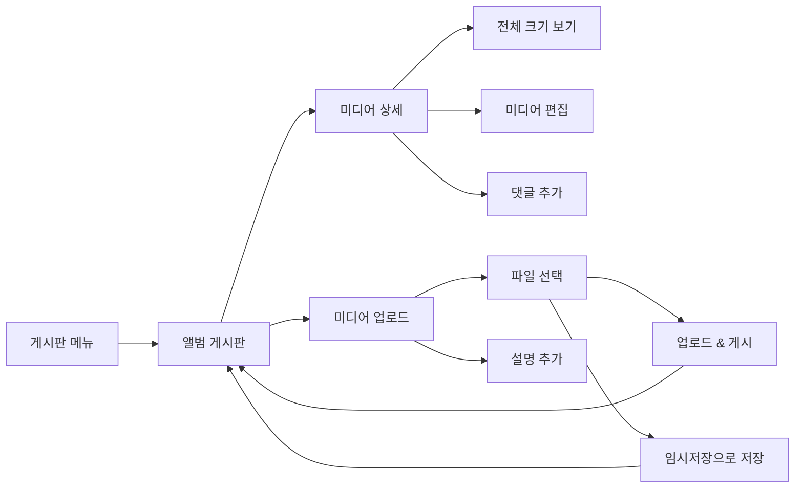

# 앨범 게시판 페이지 분석

## 📄 라우터 구성
- **Route Path**: `/board/album`
- **Router Config**: `FO_BOARD_ALBUM`, `FO_ALBUM_BOARD`
- **Query Parameters**: 
  - `bulletinId` - 앨범 게시판 식별자
  - `folderId` - 폴더 식별자
- **Navigation Guards**: `useAuthorityStore`를 통한 권한 확인
- **Parent Routes**: `/board` (메인 게시판 라우터)

## 📍 페이지 개요
- **Page Name**: Album Board (앨범 게시판)
- **File Location**: `/src/pages/board/album/`
  - `index.tsx` - 메인 진입점
  - `albumBoardPc.tsx` - 데스크톱 버전
  - `albumBoardMo.tsx` - 모바일 버전
- **Page Type**: 반응형 디자인의 시각적 미디어 갤러리
- **Primary Purpose**: 풍부한 미디어 표시 기능을 가진 사진 및 비디오 갤러리 관리
- **User Journey**: 앨범 게시판 → 갤러리 보기 → 미디어 상세 → 미디어 업로드/편집

## 🏗️ 페이지 아키텍처
```
AlbumBoard (index.tsx)
└── ResponsiveWrapper
    ├── AlbumBoardPc (Desktop)
    │   ├── FormProvider (React Hook Form)
    │   ├── HwHanboardSearch
    │   ├── HwTabs (카테고리 존재 시)
    │   └── HwTable (Album variant)
    │       ├── 썸네일이 있는 미디어 카드
    │       ├── 이미지 갤러리 표시
    │       ├── 비디오 미리보기 지원
    │       └── 답글 댓글 팝업
    └── AlbumBoardMo (Mobile)
        ├── HwBreadcrumbMo
        ├── HwHanboardSearch (조건부)
        └── 모바일 갤러리 그리드
```

## 📦 컴포넌트 매핑
| Component | Location | Purpose | Props | Events |
|-----------|----------|---------|-------|--------|
| ResponsiveWrapper | @/components/responsiveWrapper | 모바일/데스크톱 전환 | mobileComponent, desktopComponent | - |
| HwHanboardSearch | @/components/hwHanboardSearch | 앨범 검색 기능 | searchParams, bbsSchColumnList | onSearch |
| HwTable | @/components/hwTable | 미디어 갤러리 표시 | variant='album', columns, data | onRowClick, handleViewReplyCommentList |
| DetailBoardDrawer | ../general/detailBoard/detailBoardPc | 미디어 상세 드로어 | bulletinId, bulletinWritingId | - |
| CreateBoardPc | ../general/createBoard | 미디어 업로드 폼 | onSave, onDraftSave | handleSubmit |
| EditBoard | ../general/editBoard | 미디어 편집 폼 | bulletinWritingId | handleSave |
| HwBadgeCount | @/components/uiKit/badge/hwBadgeCount | 댓글 수 표시 | count | - |
| Reply Comment Popup | Custom component | 댓글 미리보기 팝업 | replyCommentList | - |

## 🔄 데이터 흐름
- **Data Sources**: 
  - 앨범 미디어 항목을 위한 `useListBulletinWriting`
  - 앨범 구성을 위한 `useBulletinFolderBoardDetail`
  - 미디어 상세 및 댓글을 위한 `useBulletinWritingDetail`
  - 미디어 콘텐츠를 위한 파일 업로드 처리
- **State Management**: 
  - 미디어 갤러리 상호작용을 위한 로컬 상태
  - 검색 및 업로드 폼을 위한 React Hook Form
  - 미디어 상세 모달을 위한 Drawer context
  - 권한을 위한 Authority store
  - 댓글 로딩을 위한 Detail params state
- **Data Transformation**: 
  - 이미지 URL 처리 (`uploadMovUrl`)
  - 미디어 메타데이터 추출
  - 댓글 스레드 조직
  - 썸네일 생성 처리
- **Data Dependencies**: 미디어 상세를 위한 bulletinId, folderId, bulletinWritingId

## ⚡ 페이지 기능
- [x] **미디어 갤러리**: 사진 및 비디오를 위한 비주얼 그리드 레이아웃
- [x] **이미지/비디오 업로드**: 미리보기가 있는 풍부한 미디어 업로드
- [x] **미디어 상세**: 전체 화면 미디어 보기 경험
- [x] **댓글 시스템**: 미디어 항목에 통합된 댓글 기능
- [x] **검색/필터링**: 콘텐츠/메타데이터로 미디어 검색
- [x] **페이지네이션**: 대용량 앨범을 위한 서버 사이드 페이지네이션
- [x] **정렬**: 날짜, 인기도 및 사용자 정의 정렬
- [x] **파일 관리**: 미디어 파일 업로드, 교체, 삭제
- [x] **임시저장 시스템**: 미디어 게시물을 임시저장으로 저장
- [x] **카테고리 지원**: 앨범 분류 시스템
- [x] **반응형 갤러리**: 적응형 그리드 레이아웃
- [x] **댓글 미리보기**: 호버/클릭 댓글 팝업

## 🔌 API 통합
| Endpoint | Method | Purpose | Trigger |
|----------|--------|---------|---------|
| `useBulletinFolderBoardDetail` | GET | 앨범 구성 로드 | 페이지 마운트 |
| `useListBulletinWriting` | GET | 미디어 항목 가져오기 | 페이지 로드, 검색, 페이지네이션 |
| `useBulletinWritingDetail` | GET | 미디어 상세 및 댓글 로드 | 댓글 미리보기 호버/클릭 |
| `useBulletinWritingCreate` | POST | 새 미디어 업로드 | 폼 제출 |
| `useBulletinWritingUpdate` | PUT | 미디어 항목 업데이트 | 편집 저장 |
| `useBulletinDeleteBulletinWriting` | DELETE | 미디어 항목 삭제 | 관리자 삭제 액션 |
| `useSaveBulletinWritingInquiryHst` | POST | 미디어 조회 추적 | 미디어 보기 |
| `useSaveAllBulletinWritingInquiryHst` | POST | 모두 읽음으로 표시 | 모두 읽기 액션 |
| `useBulletinWritingListExcelDownload` | GET | 앨범 데이터 내보내기 | Excel 내보내기 |

## 🎨 UI/UX 요소
- **Layout Type**: 미디어 카드가 있는 그리드 기반 갤러리 레이아웃
- **Responsive Breakpoints**: 화면 크기에 따른 적응형 그리드 열
- **Loading States**: 
  - 플레이스홀더가 있는 이미지 로딩
  - 데이터 가져오는 동안 갤러리 로딩
  - 업로드 진행률 표시기
- **Error States**: 
  - 이미지 로드 실패 처리
  - 업로드 오류 복구
  - 네트워크 오류 처리
- **Empty States**: 
  - 미디어 항목 없음에 대한 EmptyBoard
  - 빈 앨범을 위한 업로드 프롬프트
- **Animations**: 
  - 부드러운 갤러리 전환
  - 이미지 호버 효과
  - 댓글 팝업 애니메이션
  - 미디어 모달 전환

## 🔐 권한 및 보안
- **Authentication Required**: 예, 라우트 가드를 통해
- **Role-based Access**: 
  - `isAdministrator()` - 완전한 앨범 관리 권한
  - `canRead()` - 미디어 보기 및 댓글 읽기
  - `canReadAndWrite()` - 미디어 업로드, 댓글 게시
- **Data Validation**: 
  - 미디어 업로드를 위한 파일 타입 유효성 검사
  - 파일 크기 제한
  - 설명을 위한 콘텐츠 유효성 검사
  - 댓글 내용 유효성 검사
- **Security Features**: 
  - 파일 업로드 보안 스캔
  - 안전한 표시를 위한 이미지 처리
  - 설명 및 댓글에 대한 XSS 보호

## 📱 네비게이션 흐름


## 🧩 컴포넌트 의존성
```
Dependencies Tree
├── Shared Components
│   ├── ResponsiveWrapper
│   ├── HwTable (Album variant)
│   ├── HwTabs
│   ├── HwHanboardSearch
│   └── DrawerProvider
├── Feature Components
│   ├── DetailBoardDrawer
│   ├── CreateBoardPc
│   ├── EditBoard
│   ├── HeaderDetailBoard
│   ├── HeaderEditBoard
│   └── EmptyBoard
├── UI Components
│   ├── HwButton
│   ├── HwText
│   ├── HwBreadcrumbMo
│   ├── HwBadgeCount
│   └── Media Components
└── Hooks & Stores
    ├── useBulletinWriting suite
    ├── useDrawer
    ├── useNotify
    ├── useHwSearchParams
    └── useAuthorityStore
```

## ⚙️ 페이지 설정
- **Environment Variables**: 
  - 파일 업로드 크기 제한
  - 지원되는 미디어 형식
- **Configuration Files**: 
  - 앨범 경로를 위한 라우터 구성
  - 미디어 처리 구성
- **Constants**: 
  - 라우팅을 위한 `BOARD_ROUTER_CONFIG`
  - 임시저장/게시 상태를 위한 `BulletinWritingStatus`
  - 기본 페이지 크기: 15 (앨범 그리드에 최적화)
  - 지원되는 파일 타입 및 크기 제한
- **Default Values**: 
  - 그리드 레이아웃 매개변수
  - 이미지 품질 설정
  - 업로드 타임아웃 설정

## 🎯 주요 구현 세부사항

### 앨범 특화 기능
- **미디어 그리드 레이아웃**: 사진/비디오를 위한 최적화된 시각적 표시
- **이미지 URL 처리**: 주요 미디어를 위한 `uploadMovUrl` 필드
- **썸네일 시스템**: 자동 썸네일 생성 및 캐싱
- **댓글 통합**: 미디어 컨텍스트가 있는 풍부한 댓글 시스템
- **반응형 갤러리**: 화면 크기 기반 적응형 그리드

### 테이블 변형 구성
- 전문화된 미디어 갤러리 레이아웃을 위한 `variant='album'` 사용
- 미디어 표시를 위한 사용자 정의 열 구성
- 통합된 댓글 미리보기 기능
- 미디어 최적화 카드 렌더링

### 댓글 시스템 통합
- **Reply Comment Popup**: 댓글 미리보기를 위한 호버/클릭
- **Comment Count Display**: `HwBadgeCount` 컴포넌트 통합
- **Thread Loading**: 동적 댓글 스레드 로딩
- **Comment State Management**: 댓글 상세를 위한 별도 상태

### 미디어 처리
- **File Upload Integration**: 미리보기가 있는 풍부한 파일 업로드
- **Image Processing**: 클라이언트 사이드 이미지 리사이징 및 최적화
- **Video Support**: 비디오 업로드 및 미리보기 기능
- **Metadata Extraction**: 자동 미디어 메타데이터 처리

### 고급 기능
- **handleViewReplyCommentList**: 상호작용 시 동적 댓글 로딩
- **Detail Drawer Integration**: 전체 화면 미디어 보기 경험
- **Draft System**: 게시 전 미디어 게시물 저장
- **Excel Export**: 앨범 데이터 내보내기 기능

### 모바일 최적화
- **터치 갤러리**: 터치 친화적 미디어 탐색
- **반응형 그리드**: 모바일 최적화 갤러리 레이아웃
- **성능**: 모바일을 위한 최적화된 이미지 로딩
- **제스처 지원**: 스와이프 및 핀치-줌 기능

## 🔍 성능 고려사항
- **이미지 지연 로딩**: 대용량 앨범을 위한 점진적 이미지 로딩
- **썸네일 최적화**: 최적화된 썸네일 전달
- **페이지네이션 전략**: 미디어 갤러리를 위한 효율적인 페이지네이션
- **댓글 로딩**: 요청 시 댓글 스레드 로딩
- **Bundle 최적화**: 미디어 특화 코드 분할
- **캐싱 전략**: 미디어 자산을 위한 적극적인 캐싱

## 🚀 확장 포인트
- **고급 미디어 타입**: 추가 파일 형식 지원
- **소셜 기능**: 좋아요, 공유, 태그 기능
- **AI 통합**: 자동 태깅 및 분류
- **대량 작업**: 대량 업로드 및 조직 도구
- **고급 편집**: 브라우저 내 이미지 편집 기능
- **클라우드 스토리지**: 클라우드 스토리지 서비스와 통합
- **실시간 협업**: 라이브 댓글 및 반응
- **슬라이드쇼 모드**: 자동 갤러리 프레젠테이션
- **검색 향상**: 시각적 유사성 검색
- **내보내기 옵션**: 다양한 내보내기 형식 및 크기

## 🎨 시각적 디자인 기능
- **그리드 적응**: 콘텐츠 기반 동적 열 조정
- **카드 호버 효과**: 대화형 미디어 미리보기 향상
- **로딩 애니메이션**: 미디어를 위한 부드러운 로딩 전환
- **댓글 배지 디자인**: 시각적 댓글 수 표시기
- **빈 상태 그래픽**: 매력적인 빈 앨범 시각적 요소

## 📊 분석 및 인사이트
- **미디어 조회 추적**: 포괄적인 조회 분석
- **인기 콘텐츠**: 가장 많이 본 미디어 식별
- **사용자 참여**: 댓글 및 상호작용 지표
- **업로드 통계**: 미디어 업로드 빈도 및 타입
- **성능 지표**: 갤러리 로드 시간 및 사용자 행동

## ⚡ 기술 최적화
- **이미지 압축**: 웹 전달을 위한 자동 압축
- **점진적 로딩**: Progressive JPEG 지원
- **WebP 지원**: 현대적인 이미지 형식 최적화
- **CDN 통합**: 콘텐츠 전달 네트워크 준비
- **메타데이터 인덱싱**: 효율적인 미디어 메타데이터 검색