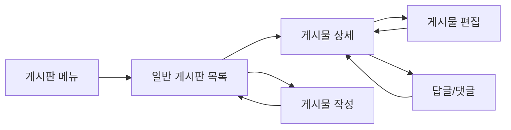

# 일반 게시판 (기본 게시판) 페이지 분석

## 📄 라우터 구성
- **라우트 경로**: `/board/basic`
- **라우터 설정**: `FO_BOARD_BASIC`
- **쿼리 파라미터**: 
  - `bulletinId` - 게시판 식별자
  - `folderId` - 폴더 식별자
- **네비게이션 가드**: `useAuthorityStore`를 통한 권한 확인
- **부모 라우트**: `/board` (메인 게시판 라우터)

## 📍 페이지 개요
- **페이지 명**: 일반 게시판 (기본 게시판)
- **파일 위치**: `/src/pages/board/basic/`
  - `index.tsx` - 메인 진입점
  - `basicBoardPc.tsx` - 데스크톱 버전
  - `basicBoardMo.tsx` - 모바일 버전
  - `basicBoardList.tsx` - 게시판 목록 컴포넌트
  - `types.ts` - TypeScript 정의
- **페이지 타입**: 반응형 디자인이 적용된 동적 페이지
- **주요 목적**: 카테고리가 있는 게시물 표시 및 관리를 위한 일반 게시판
- **사용자 여정**: 게시판 네비게이션 → 목록 보기 → 상세 보기 → 생성/편집

## 🏗️ 페이지 아키텍처
```
BasicBoard (index.tsx)
└── ResponsiveWrapper
    ├── BasicBoardPc (Desktop)
    │   ├── FormProvider (React Hook Form)
    │   ├── HwHanboardSearch
    │   └── HwTabs/BasicBoardList
    │       └── HwTable
    └── BasicBoardMo (Mobile)
        ├── HwBreadcrumbMo
        ├── HwHanboardSearch (conditional)
        └── HwTabs/HwTable
```

## 📦 컴포넌트 매핑
| 컴포넌트 | 위치 | 목적 | Props | 이벤트 |
|-----------|----------|---------|-------|--------|
| ResponsiveWrapper | @/components/responsiveWrapper | 모바일/데스크톱 전환 | mobileComponent, desktopComponent | - |
| HwHanboardSearch | @/components/hwHanboardSearch | 검색 기능 | searchParams, onSearch, bbsSchColumnList | onSearch |
| HwTable | @/components/hwTable | 데이터 테이블 표시 | columns, data, pagination props | onPageChange, onSelectedRowsChange |
| HwTabs | @/components/uiKit/hwTabs | 카테고리 탭 | tabs, defaultTab | onChange |
| BasicBoardList | ./basicBoardList | 게시판 목록 로직 | searchFilterParams, bulletinInfo | - |
| HwBreadcrumbMo | @/components/hwBreadcrumbMo | 모바일 breadcrumb | title, showFilter | handleFilterClick |

## 🔄 데이터 플로우
- **데이터 소스**: 
  - API 호출을 위한 `useBulletinWriting` 훅
  - 게시판 구성을 위한 `useBulletinFolderBoardDetail`
  - 게시물 데이터를 위한 `useBulletinWritingList`
- **상태 관리**: 
  - React 훅을 사용한 로컬 상태
  - 검색 폼을 위한 React Hook Form
  - 권한을 위한 `useAuthorityStore`
- **데이터 변환**: 
  - `bbsSchColumnUtils`를 통한 동적 필드 처리
  - dayjs를 사용한 날짜 형식화
  - HTML 콘텐츠 정리
- **데이터 의존성**: bulletinId, folderId 파라미터 필요

## ⚡ 페이지 기능
- [x] **CRUD 작업**: 게시물 생성, 읽기, 업데이트, 삭제
- [x] **검색/필터링**: 동적 필드를 사용한 고급 검색
- [x] **페이지네이션**: 서버 사이드 페이지네이션
- [x] **정렬**: 데이터 정렬 기능
- [x] **파일 업로드/다운로드**: 첨부파일 처리, Excel 내보내기
- [x] **실시간 업데이트**: 읽음 상태 추적
- [x] **폼 처리**: 게시물 생성/편집
- [x] **모달/팝업**: Drawer 기반 상세 보기 및 편집
- [x] **카테고리 탭**: 동적 분류 탭
- [x] **반응형 디자인**: 모바일/데스크톱 변형

## 🔌 API 통합
| 엔드포인트 | 메서드 | 목적 | 트리거 |
|----------|--------|---------|---------|
| `useBulletinFolderBoardDetail` | GET | 게시판 구성 로드 | 페이지 마운트 |
| `useBulletinWritingList` | GET | 게시물 목록 가져오기 | 페이지 로드, 검색, 페이지네이션 |
| `useBulletinWritingCreate` | POST | 새 게시물 생성 | 폼 제출 |
| `useBulletinWritingUpdate` | PUT | 기존 게시물 업데이트 | 편집 폼 제출 |
| `useBulletinDeleteBulletinWriting` | DELETE | 게시물 삭제 | 삭제 버튼 액션 |
| `useSaveBulletinWritingInquiryHst` | POST | 읽음 표시 | 읽음 버튼 액션 |
| `useSaveAllBulletinWritingInquiryHst` | POST | 모두 읽음 표시 | 모두 읽음 버튼 |
| `useBulletinWritingListExcelDownload` | GET | Excel로 내보내기 | Excel 다운로드 버튼 |

## 🎨 UI/UX 요소
- **레이아웃 타입**: 모바일/데스크톱 변형이 있는 반응형 래퍼
- **반응형 브레이크포인트**: ResponsiveWrapper 컴포넌트로 처리
- **로딩 상태**: 테이블 로딩, 폼 제출 상태
- **오류 상태**: 폼 유효성 검사, API 오류 처리
- **빈 상태**: 데이터가 없는 시나리오를 위한 EmptyBoard 컴포넌트
- **애니메이션**: Drawer 전환, 테이블 상호작용

## 🔐 권한 및 보안
- **인증 필요**: 예, 라우트 가드로 관리
- **역할 기반 액세스**: 
  - `isAdministrator()` - 삭제 권한
  - `canRead()` - 읽기 권한
  - `canReadAndWrite()` - 생성/편집 권한
- **데이터 검증**: 
  - Yup 스키마를 사용한 폼 검증
  - 검색 텍스트 최소 길이 검증
  - 동적 필드 검증
- **보안 기능**: HTML 콘텐츠 정리를 통한 XSS 보호

## 📱 네비게이션 플로우


## 🧩 컴포넌트 의존성
```
의존성 트리
├── 공유 컴포넌트
│   ├── ResponsiveWrapper
│   ├── HwTable
│   ├── HwTabs
│   └── HwHanboardSearch
├── 기능 컴포넌트
│   ├── BasicBoardList
│   ├── CreateBoardPc
│   ├── EditBoard
│   ├── DetailBoardDrawer
│   └── EmptyBoard
├── UI 컴포넌트
│   ├── HwButton
│   ├── HwText
│   ├── HwBreadcrumbMo
│   └── DrawerProvider
└── 훅
    ├── useBulletinWriting
    ├── useHwSearchParams
    ├── useDrawer
    ├── useNotify
    └── useAuthorityStore
```

## ⚙️ 페이지 구성
- **환경 변수**: 특정 사항 없음
- **구성 파일**: 라우터 구성
- **상수**: 
  - 라우팅을 위한 `BOARD_ROUTER_CONFIG`
  - 검색 유형 옵션
  - 페이지 크기 옵션 [10, 20, 30]
- **기본값**: 
  - 페이지 크기: bulletinInfo.listCnt 기반 또는 기본값 10
  - 검색 유형: '1' (기본 검색 유형)
  - 동적 스키마의 폼 기본값

## 🎯 주요 구현 세부사항

### 동적 필드 시스템
- 동적 검색 필드를 위해 `bbsSchColumnUtils` 사용
- 사용자 정의 컬럼 타입 및 검증 지원
- 게시판 구성에 기반한 동적 폼 스키마 생성

### 검색 기능
- dayjs 형식화를 사용한 날짜 범위 검색
- 최소 2자 요구사항이 있는 텍스트 검색
- 게시판 구성에 기반한 동적 필드 검색
- 검색 상태 지속성

### 테이블 기능
- 동적 컬럼 생성
- 대량 작업이 있는 행 선택
- 읽음/읽지 않음 상태 추적
- 답글 계층 구조 지원 (highBulletinWritingId)
- 첨부파일 및 댓글 수 표시

### 모바일 적응
- 다른 UX를 가진 별도의 모바일 컴포넌트
- 모바일에 최적화된 테이블 뷰
- 접을 수 있는 검색 필터
- 터치 친화적 상호작용

## 🔍 성능 고려사항
- 대용량 데이터셋 처리를 위한 서버 사이드 페이지네이션
- 메모화된 컬럼 및 데이터 변환
- 빈 상태에 대한 조건부 렌더링
- useCallback 및 useMemo를 사용한 최적화된 재렌더링

## 🚀 확장 포인트
- 추가 검색 필드 타입
- 사용자 정의 테이블 셀 렌더러
- 향상된 모바일 상호작용
- WebSocket을 통한 실시간 업데이트
- 고급 필터링 옵션
- 대량 작업 확장