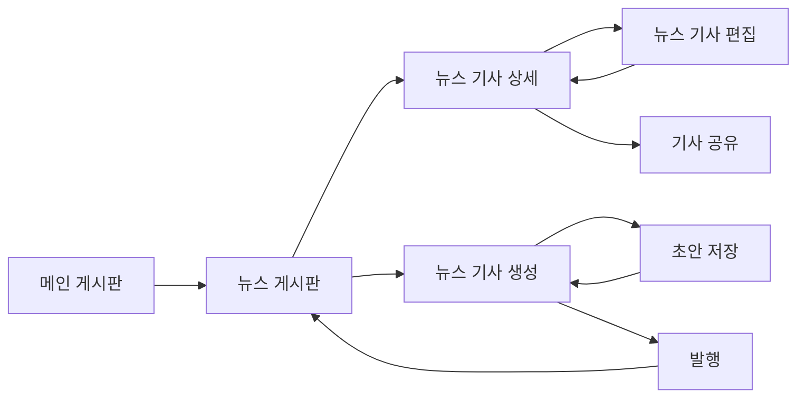

# 뉴스 게시판 페이지 분석

## 📄 라우터 구성
- **라우트 경로**: `/board/news`
- **라우터 설정**: `FO_BOARD_NEWS`, `FO_NEWS_BOARD`
- **쿼리 파라미터**: 
  - `bulletinId` - 뉴스 게시판 식별자
  - `folderId` - 폴더 식별자
- **네비게이션 가드**: `useAuthorityStore`를 통한 권한 확인
- **부모 라우트**: `/board` (메인 게시판 라우터)

## 📍 페이지 개요
- **페이지 명**: 뉴스 게시판
- **파일 위치**: `/src/pages/board/news/`
  - `index.tsx` - 메인 진입점
  - `newsBoardPc.tsx` - 데스크톱 버전
  - `newsBoardMo.tsx` - 모바일 버전
- **페이지 타입**: 반응형 디자인이 적용된 동적 뉴스 표시
- **주요 목적**: 멀티미디어 지원이 있는 기업 뉴스 및 공지사항 표시
- **사용자 여정**: 뉴스 게시판 → 목록 보기 → 상세 보기 → 생성/편집 (관리자만)

## 🏗️ 페이지 아키텍처
```
NewsBoard (index.tsx)
└── ResponsiveWrapper
    ├── NewsBoardPc (Desktop)
    │   ├── FormProvider (React Hook Form)
    │   ├── HwHanboardSearch
    │   ├── HwTabs (if categories exist)
    │   └── HwTable (News variant)
    │       ├── News Cards with Images
    │       ├── Rich Content Display
    │       └── Multimedia Support
    └── NewsBoardMo (Mobile)
        ├── HwBreadcrumbMo
        ├── HwHanboardSearch (conditional)
        └── Mobile-optimized News Cards
```

## 📦 컴포넌트 매핑
| 컴포넌트 | 위치 | 목적 | Props | 이벤트 |
|-----------|----------|---------|-------|--------|
| ResponsiveWrapper | @/components/responsiveWrapper | 모바일/데스크톱 전환 | mobileComponent, desktopComponent | - |
| HwHanboardSearch | @/components/hwHanboardSearch | 뉴스 검색 기능 | searchParams, bbsSchColumnList | onSearch |
| HwTable | @/components/hwTable | 뉴스 표시 테이블 | variant='news', columns, data | onRowClick, onPageChange |
| DetailBoardDrawer | ../general/detailBoard/detailBoardPc | 뉴스 상세 drawer | bulletinId, bulletinWritingId | - |
| CreateBoardPc | ../general/createBoard | 뉴스 생성 폼 | onSave, onDraftSave | handleSubmit |
| EditBoard | ../general/editBoard | 뉴스 편집 폼 | bulletinWritingId | handleSave |
| HeaderDetailBoard | ../general/detailBoard/detailBoardPc/headerDetail | 상세 헤더 | onEditMode, onCloseDrawer | - |

## 🔄 데이터 플로우
- **데이터 소스**: 
  - 뉴스 작업을 위한 `useBulletinWriting` 훅 모음
  - 게시판 구성을 위한 `useBulletinFolderBoardDetail`
  - 뉴스 기사를 위한 `useBulletinWritingList`
  - 콘텐츠 생성을 위한 `useBulletinWritingCreate`
- **상태 관리**: 
  - React 훅을 사용한 로컬 상태 관리
  - 검색 및 콘텐츠 폼을 위한 React Hook Form
  - 모달 관리를 위한 Drawer 컨텍스트
  - 권한을 위한 Authority store
- **데이터 변환**: 
  - 발행 날짜를 위한 날짜 형식화
  - 리치 텍스트를 위한 HTML 콘텐츠 처리
  - 멀티미디어 콘텐츠를 위한 이미지 URL 처리
  - 동적 필드 처리
- **데이터 의존성**: URL 파라미터에서 bulletinId와 folderId 필요

## ⚡ 페이지 기능
- [x] **CRUD 작업**: 전체 뉴스 생명주기 관리
- [x] **리치 콘텐츠**: 미디어 지원이 있는 HTML 콘텐츠
- [x] **검색/필터링**: 날짜 범위가 있는 고급 뉴스 검색
- [x] **페이지네이션**: 뉴스 기사를 위한 서버 사이드 페이지네이션
- [x] **정렬**: 시간순 및 관련성 정렬
- [x] **파일 관리**: 이미지 업로드, 첨부파일 처리
- [x] **초안 시스템**: 발행 전 초안 저장
- [x] **폼 처리**: 리치 텍스트 에디터 통합
- [x] **모달/Drawer**: 전체 화면 뉴스 읽기 경험
- [x] **카테고리 지원**: 뉴스 분류 시스템
- [x] **읽음 추적**: 조회수 및 읽음 상태
- [x] **Excel 내보내기**: 뉴스 데이터 내보내기 기능

## 🔌 API 통합
| 엔드포인트 | 메서드 | 목적 | 트리거 |
|----------|--------|---------|---------|
| `useBulletinFolderBoardDetail` | GET | 뉴스 게시판 설정 로드 | 페이지 마운트 |
| `useBulletinWritingList` | GET | 뉴스 기사 가져오기 | 페이지 로드, 검색, 페이지네이션 |
| `useBulletinWritingCreate` | POST | 뉴스 기사 생성 | 폼 제출 |
| `useBulletinWritingUpdate` | PUT | 뉴스 기사 업데이트 | 편집 저장 |
| `useBulletinDeleteBulletinWriting` | DELETE | 뉴스 기사 삭제 | 관리자 삭제 액션 |
| `useSaveBulletinWritingInquiryHst` | POST | 기사 조회 추적 | 기사 읽기 |
| `useSaveAllBulletinWritingInquiryHst` | POST | 모두 읽음 표시 | 모두 읽음 액션 |
| `useBulletinWritingListExcelDownload` | GET | 뉴스 데이터 내보내기 | Excel 내보내기 |

## 🎨 UI/UX 요소
- **레이아웃 타입**: 이미지 미리보기가 있는 카드 기반 뉴스 레이아웃
- **반응형 브레이크포인트**: 모바일 우선 반응형 디자인
- **로딩 상태**: 
  - 데이터 가져오기 중 테이블 로딩
  - 폼 제출 로딩
  - 이미지 로딩 상태
- **오류 상태**: 
  - 검색 유효성 검사 오류
  - 폼 제출 오류
  - 네트워크 오류 처리
- **빈 상태**: 
  - 뉴스가 없을 때를 위한 EmptyBoard 컴포넌트
  - 필터별 빈 상태
- **애니메이션**: 
  - 부드러운 drawer 전환
  - 카드 hover 효과
  - 로딩 스피너

## 🔐 권한 및 보안
- **인증 필요**: 예, 라우트 가드를 통해
- **역할 기반 액세스**: 
  - `isAdministrator()` - 전체 CRUD 권한
  - `canRead()` - 읽기 및 읽음 표시 권한
  - `canReadAndWrite()` - 생성/편집 권한
- **데이터 검증**: 
  - 리치 텍스트 콘텐츠 검증
  - 검색 파라미터 검증
  - 파일 업로드 검증
  - 동적 필드 검증
- **보안 기능**: 
  - HTML 콘텐츠에 대한 XSS 보호
  - 파일 업로드 제한
  - 입력 정리

## 📱 네비게이션 플로우


## 🧩 컴포넌트 의존성
```
의존성 트리
├── 공유 컴포넌트
│   ├── ResponsiveWrapper
│   ├── HwTable (News variant)
│   ├── HwTabs
│   ├── HwHanboardSearch
│   └── DrawerProvider
├── 기능 컴포넌트
│   ├── DetailBoardDrawer
│   ├── CreateBoardPc
│   ├── EditBoard
│   ├── HeaderDetailBoard
│   ├── HeaderEditBoard
│   └── EmptyBoard
├── UI 컴포넌트
│   ├── HwButton
│   ├── HwText
│   ├── HwBreadcrumbMo
│   └── Image/Media Components
└── 훅 및 스토어
    ├── useBulletinWriting
    ├── useDrawer
    ├── useNotify
    ├── useHwSearchParams
    ├── useBulletinType
    └── useAuthorityStore
```

## ⚙️ 페이지 구성
- **환경 변수**: 뉴스 게시판에 특정한 것 없음
- **구성 파일**: 
  - 뉴스 경로를 위한 라우터 구성
  - 게시판 타입 구성
- **상수**: 
  - 라우팅을 위한 `BOARD_ROUTER_CONFIG`
  - 초안/발행 상태를 위한 `BulletinWritingStatus`
  - 검색 타입 옵션
  - 페이지 크기 옵션
- **기본값**: 
  - 페이지 크기: 10 (뉴스 기본값)
  - 검색 타입: '1'
  - 날짜 범위: 빈 값 (모든 날짜)

## 🎯 주요 구현 세부사항

### 뉴스별 기능
- **리치 미디어 지원**: 이미지 및 비디오 콘텐츠와의 통합
- **발행 워크플로우**: 초안 → 검토 → 발행 파이프라인
- **콘텐츠 관리**: 뉴스 콘텐츠를 위한 리치 텍스트 에디터
- **이미지 처리**: 특성 이미지를 위한 `uploadMovUrl` 필드
- **조회 추적**: 뉴스 소비에 대한 종합 분석

### 테이블 변형
- 전문화된 뉴스 카드 레이아웃을 위해 `variant='news'` 사용
- 특성 이미지, 발행 날짜, 콘텐츠 미리보기 표시
- `announceUseYn`을 통한 공지사항 플래그 지원
- 뉴스 소비를 위한 향상된 시각적 프레젠테이션

### 검색 기능
- **날짜 범위 검색**: 발행 날짜 필터링
- **콘텐츠 검색**: 뉴스 콘텐츠의 전문 검색
- **카테고리 검색**: 뉴스 분류 필터링
- **동적 필드**: 게시판별 검색 파라미터
- **고급 검증**: 최소 검색 길이 요구사항

### Drawer 통합
- **전체 화면 읽기**: 몰입형 뉴스 읽기 경험
- **편집 모드 전환**: 편집으로의 원활한 전환
- **모달 확인**: 저장하지 않은 변경사항 보호
- **컨텍스트 관리**: 모달 중 적절한 상태 관리

### 모바일 최적화
- **터치 친화적**: 모바일에 최적화된 상호작용
- **반응형 이미지**: 적응형 이미지 크기 조정
- **간소화된 네비게이션**: 모바일 breadcrumb 시스템
- **성능**: 모바일 데이터 사용량에 최적화

## 🔍 성능 고려사항
- **이미지 최적화**: 뉴스 이미지를 위한 지연 로딩
- **콘텐츠 페이지네이션**: 대용량 뉴스 아카이브를 위한 서버 사이드 페이지네이션
- **검색 디바운싱**: 최적화된 검색 입력 처리
- **메모화**: 캐시된 비용이 많이 드는 계산
- **번들 분할**: 뉴스별 기능을 위한 코드 분할

## 🚀 확장 포인트
- **실시간 업데이트**: 속보를 위한 WebSocket 통합
- **소셜 기능**: 공유, 댓글, 반응
- **SEO 최적화**: 메타 태그 및 구조화된 데이터
- **분석**: 향상된 뉴스 소비 분석
- **다국어 지원**: 국제 뉴스를 위한 I18n
- **RSS 피드**: 뉴스 신디케이션 기능
- **푸시 알림**: 속보 알림