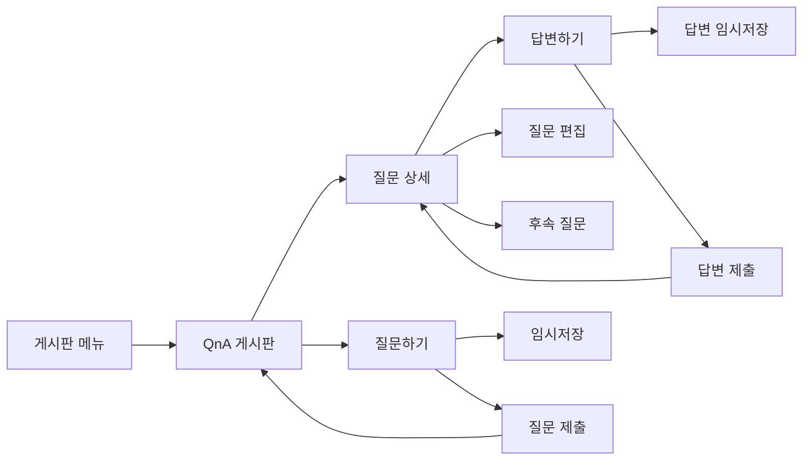

# Q&A 게시판 페이지 분석

## 📄 라우터 구성
- **Route Path**: `/board/qna`
- **Router Config**: `FO_BOARD_QNA`
- **Query Parameters**: 
  - `bulletinId` - QnA 게시판 식별자
  - `folderId` - 폴더 식별자
- **Navigation Guards**: `useAuthorityStore`를 통한 권한 확인
- **Parent Routes**: `/board` (메인 게시판 라우터)

## 📍 페이지 개요
- **Page Name**: QnA Board (질문과 답변)
- **File Location**: `/src/pages/board/qna/`
  - `index.tsx` - 메인 진입점
  - `qnaBoardPc.tsx` - 데스크톱 버전
  - `qnaBoardMo.tsx` - 모바일 버전
  - `detailBoardQnA/` - QnA 상세 컴포넌트
  - `formBoardQnA/` - QnA 폼 컴포넌트
  - `answerBoardQnA/` - 답변 폼 컴포넌트
  - `common.ts` - 공유 유틸리티
- **Page Type**: 반응형 디자인의 대화형 Q&A 시스템
- **Primary Purpose**: 계층 구조를 가진 질문과 답변 관리
- **User Journey**: QnA 게시판 → 질문 목록 → 질문 상세 → 답변/답글

## 🏗️ 페이지 아키텍처
```
QnaBoard (index.tsx)
└── ResponsiveWrapper
    ├── QnaBoardPc (Desktop)
    │   ├── FormProvider (React Hook Form)
    │   ├── HwHanboardSearch
    │   ├── HwTabs (카테고리 존재 시)
    │   └── HwTable (QnA 변형)
    │       ├── Question Cards
    │       ├── Answer Status
    │       └── Reply Threading
    └── QnaBoardMo (Mobile)
        ├── HwBreadcrumbMo
        ├── HwHanboardSearch (조건부)
        └── Mobile QnA Cards
```

## 📦 컴포넌트 매핑
| Component | Location | Purpose | Props | Events |
|-----------|----------|---------|-------|--------|
| ResponsiveWrapper | @/components/responsiveWrapper | 모바일/데스크톱 전환 | mobileComponent, desktopComponent | - |
| HwHanboardSearch | @/components/hwHanboardSearch | QnA 검색 기능 | searchParams, bbsSchColumnList | onSearch |
| HwTable | @/components/hwTable | QnA 표시 테이블 | variant='qna', columns, data | onRowClick, onPageChange |
| FormBoardQnAPc | ./formBoardQnA/formBoardQnAPc | 질문 생성/편집 폼 | isEditMode, bulletinWritingId | onSave, onDraftSave |
| AnswerBoardQnAPc | ./answerBoardQnA/answerBoardQnAPc | 답변 생성 폼 | - | onSave, onDraftSave |
| DetailQnADrawer | ./detailBoardQnA/detailQnADrawer | QnA 상세 뷰 | - | - |
| HeaderDetailBoard | ../general/detailBoard/detailBoardPc/headerDetail | QnA 액션이 포함된 상세 헤더 | isQna=true, onWriteAnswer | - |

## 🔄 데이터 흐름
- **Data Sources**: 
  - QnA 게시판 구성을 위한 `useBulletinFolderBoardDetail`
  - Mock 데이터 시스템 (TODO: 실제 API로 교체)
  - Q&A 상호작용을 위한 로컬 상태 관리
- **State Management**: 
  - Q&A 흐름을 위한 React hooks 로컬 상태
  - 질문/답변 폼을 위한 React Hook Form
  - 모달 관리를 위한 Drawer context
  - 권한을 위한 Authority store
- **Data Transformation**: 
  - 질문/답변 계층 구조
  - 답변된 질문의 상태 추적
  - Q&A 타임스탬프의 날짜 포맷팅
  - 사용자 정의 필드를 위한 동적 필드 처리
- **Data Dependencies**: URL 매개변수의 bulletinId와 folderId

## ⚡ 페이지 기능
- [x] **Q&A 워크플로우**: 질문 게시 → 답변 제공 → 스레드 관리
- [x] **계층 구조**: 질문 → 답변 → 후속 질문
- [x] **상태 추적**: 답변됨/미답변 질문 상태
- [x] **검색/필터링**: 질문과 답변 검색
- [x] **페이지네이션**: Q&A 데이터의 서버 사이드 페이지네이션
- [x] **임시저장 시스템**: 질문/답변 임시저장 기능
- [x] **폼 처리**: 질문과 답변을 위한 풍부한 폼
- [x] **모달/드로어**: 완전한 Q&A 상호작용 경험
- [x] **카테고리 지원**: QnA 주제 분류
- [x] **읽기 추적**: 조회수 및 읽기 상태
- [x] **역할 기반 액션**: 다양한 사용자 역할에 따른 다른 액션

## 🔌 API 통합
| Endpoint | Method | Purpose | Trigger | Status |
|----------|--------|---------|---------|--------|
| `useBulletinFolderBoardDetail` | GET | QnA 게시판 구성 로드 | 페이지 마운트 | ✅ 구현됨 |
| QnA List API | GET | 질문 목록 가져오기 | 페이지 로드, 검색 | 🚧 Mock Data |
| Question Create API | POST | 새 질문 생성 | 폼 제출 | 🚧 Mock Data |
| Answer Create API | POST | 답변 생성 | 답변 제출 | 🚧 Mock Data |
| Question Update API | PUT | 질문 업데이트 | 편집 저장 | 🚧 Mock Data |
| Answer Update API | PUT | 답변 업데이트 | 답변 편집 | 🚧 Mock Data |
| Delete API | DELETE | Q&A 항목 삭제 | 관리자 삭제 | 🚧 Mock Data |
| Read Tracking API | POST | Q&A 조회 추적 | 보기 액션 | 🚧 Mock Data |

## 🎨 UI/UX 요소
- **Layout Type**: 답변 중첩이 있는 스레드 기반 Q&A 레이아웃
- **Responsive Breakpoints**: 모바일 우선 반응형 디자인
- **Loading States**: 
  - 데이터 가져오는 동안 테이블 로딩
  - 폼 제출 로딩
  - 답변 게시 로딩
- **Error States**: 
  - 폼 유효성 검사 오류
  - 제출 오류 처리
  - 네트워크 오류 복구
- **Empty States**: 
  - 질문 없음에 대한 EmptyBoard
  - "아직 답변 없음" 상태
- **Animations**: 
  - 드로어 전환
  - 답변 스레드 애니메이션
  - 로딩 상태

## 🔐 권한 및 보안
- **Authentication Required**: 예, 라우트 가드를 통해
- **Role-based Access**: 
  - `isAdministrator()` - 완전한 조정 권한
  - `canRead()` - 읽기 및 읽음 표시 권한
  - `canReadAndWrite()` - 질문하기, 답변 제공
- **Data Validation**: 
  - 질문 내용 유효성 검사
  - 답변 내용 유효성 검사
  - 검색 매개변수 유효성 검사
  - 동적 필드 유효성 검사
- **Security Features**: 
  - Q&A 내용에 대한 XSS 보호
  - 입력 소독
  - 내용 조정 기능

## 📱 네비게이션 흐름


## 🧩 컴포넌트 의존성
```
Dependencies Tree
├── Shared Components
│   ├── ResponsiveWrapper
│   ├── HwTable (QnA variant)
│   ├── HwTabs
│   ├── HwHanboardSearch
│   └── DrawerProvider
├── QnA Feature Components
│   ├── FormBoardQnAPc
│   ├── AnswerBoardQnAPc
│   ├── DetailQnADrawer
│   └── EmptyBoard
├── General Components
│   ├── HeaderDetailBoard
│   ├── HeaderEditBoard
│   └── DetailBoardDrawer
├── UI Components
│   ├── HwButton
│   ├── HwText
│   └── HwBreadcrumbMo
└── Hooks & Stores
    ├── useBulletinWriting
    ├── useDrawer
    ├── useNotify
    ├── useHwSearchParams
    └── useAuthorityStore
```

## ⚙️ 페이지 설정
- **Environment Variables**: QnA 특화 환경변수 없음
- **Configuration Files**: 
  - QnA 경로를 위한 라우터 구성
  - 게시판 타입 구성
- **Constants**: 
  - Mock 데이터 구성 (common.ts의 `mockData`)
  - 라우팅을 위한 `BOARD_ROUTER_CONFIG`
  - 검색 타입 옵션
  - 페이지 크기 옵션
- **Default Values**: 
  - 페이지 크기: 10 (기본값)
  - 검색 타입: '1'
  - Mock 페이지네이션 정보

## 🎯 주요 구현 세부사항

### Q&A 특화 기능
- **질문-답변 페어링**: 계층 관계 관리
- **상태 관리**: 답변됨 대 미답변 질문 추적
- **답변 스레드**: 질문당 여러 답변 지원
- **전문가 식별**: 역할 기반 답변 강조
- **베스트 답변 선택**: 선호 답변 표시

### Mock 데이터 시스템
현재 개발용 mock 데이터 사용:
```typescript
// common.ts의 Mock 데이터 구조
const mockData = {
  bulletinViewColumnList: [...],
  bulletinWritingList: [...]
}
```
**TODO**: 실제 API 통합으로 교체

### QnA 테이블 변형
- 전문화된 Q&A 레이아웃을 위한 `variant='qna'` 사용
- 질문 상태, 답변 수, 마지막 활동 표시
- 질문 긴급성/우선순위 지표 지원
- 답변됨/미답변 상태를 위한 강화된 시각적 단서

### 폼 컴포넌트
- **FormBoardQnAPc**: 질문 생성 및 편집 처리
- **AnswerBoardQnAPc**: 전용 답변 작성 인터페이스
- 둘 다 임시저장과 풍부한 내용 편집 지원
- 사용자 정의 Q&A 규칙이 있는 폼 유효성 검사

### 드로어 통합
- **isQna Flag**: 상세 헤더를 위한 특별한 QnA 모드
- **onWriteAnswer**: 전용 답변 생성 흐름
- **Modal Management**: 컨텍스트 인식 상태 처리
- **Answer Threading**: 중첩 답변 표시

### 모바일 최적화
- **터치 친화적**: 모바일 최적화 Q&A 상호작용
- **컴팩트 디스플레이**: 압축된 Q&A 정보
- **반응형 폼**: 모바일 폼 적응
- **제스처 지원**: Q&A 관리를 위한 스와이프 액션

## 🔍 성능 고려사항
- **지연 로딩**: 요청 시 답변 로드
- **검색 최적화**: 디바운스된 검색 입력
- **Mock Data 효율성**: 개발용 임시 mock 시스템
- **상태 관리**: Q&A 상호작용을 위한 최적화된 재렌더링
- **Bundle Size**: Q&A 특화 기능을 위한 코드 분할

## 🚀 확장 포인트
- **실제 API 통합**: mock 데이터를 실제 백엔드로 교체
- **실시간 업데이트**: 라이브 Q&A 상호작용
- **고급 검색**: Q&A 내용 전문 검색
- **게임화**: 도움이 되는 답변에 대한 포인트/배지
- **전문가 시스템**: 검증된 전문가 답변
- **분석**: Q&A 참여 지표
- **알림**: 새 답변에 대한 알림 시스템
- **AI 통합**: 제안 답변 또는 유사 질문
- **카테고리 관리**: 고급 주제 조직
- **조정 도구**: 콘텐츠 조정 워크플로우

## ⚠️ 현재 제한사항
- **Mock Data**: 실제 API 대신 현재 플레이스홀더 데이터 사용
- **제한된 API 통합**: 여러 엔드포인트가 아직 구현되지 않음
- **하드코딩된 값**: 일부 구성 값이 동적으로 만들어져야 함
- **테스트**: 실제 데이터 시나리오를 사용한 포괄적인 테스트 필요

## 🔧 마이그레이션 TODO 항목
1. mock 데이터를 실제 API 엔드포인트로 교체
2. 실제 Q&A 데이터 구조 구현
3. 실시간 답변 알림 추가
4. Q&A 내용에 대한 검색 기능 강화
5. Q&A 특화 작업에 대한 적절한 오류 처리 추가