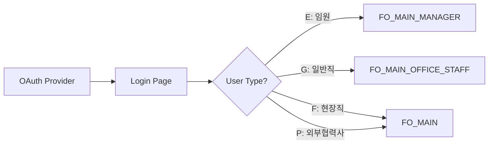

# 로그인 페이지 분석

## 📄 페이지 개요

- **페이지 명**: 로그인 폼
- **파일 위치**: `/src/pages/login/index.tsx`
- **페이지 타입**: OAuth 콜백 핸들러
- **주요 목적**: OAuth 인증 플로우 처리 및 인증 성공 후 사용자 리다이렉트
- **사용자 여정**: OAuth 제공자 → 로그인 페이지 → 인증된 메인 페이지

## 🛤️ 라우터 구성

- **라우트 경로**: `/login`
- **라우트 파라미터**: 없음
- **쿼리 파라미터**: 
  - `code` - OAuth 인증 코드
  - `state` - 보안을 위한 OAuth 상태 파라미터
  - `scope` - OAuth 스코프 권한
  - `error` - OAuth 오류 코드 (있는 경우)
  - `error_description` - OAuth 오류 설명
- **네비게이션 가드**: 공개 라우트 (인증 불필요)
- **부모/자식 라우트**: 독립적인 공개 라우트

## 🏗️ 페이지 아키텍처

```
LoginForm Component
└── HwLoading (Loading Spinner)
    └── Spinner (Chakra UI)
```

## 📦 컴포넌트 매핑

| 컴포넌트 | 위치 | 목적 | Props | 이벤트 |
|-----------|----------|---------|-------|--------|
| LoginForm | `/src/pages/login/index.tsx` | OAuth 콜백 핸들러 및 인증 플로우 관리자 | 없음 | OAuth 토큰 교환, 사용자 정보 검색 |
| HwLoading | `/src/components/uiKit/hwSpinner.tsx` | 로딩 상태 표시기 | 없음 | 없음 |

## 🔄 데이터 플로우

- **데이터 소스**: 
  - URL 파라미터 (OAuth 콜백 데이터)
  - API 응답 (토큰 교환, 사용자 정보)
  - Local Storage (액세스 토큰)
- **상태 관리**: Zustand store (`useAuthStore`)
- **데이터 변환**: 
  - URL에서 OAuth 파라미터 추출
  - 사용자 정보를 계정 객체로 매핑
- **데이터 의존성**: 
  - OAuth 토큰 교환 API
  - 사용자 정보 API
  - 사용자 권한 메뉴 목록 API

## ⚡ 인증 기능

- [x] OAuth 2.0 플로우 처리
- [x] 토큰 교환 메커니즘  
- [x] 사용자 정보 검색
- [x] 역할 기반 메뉴 권한
- [x] 오류 처리 및 알림
- [x] 로컬 스토리지 토큰 관리
- [x] 사용자 타입에 따른 자동 리다이렉트
- [ ] 전통적인 폼 기반 로그인
- [ ] 로그인 정보 기억 기능
- [ ] 비밀번호 재설정

## 🔌 API 통합

| 엔드포인트 | 메서드 | 목적 | 트리거 |
|----------|--------|---------|---------|
| OAuth Token Exchange | POST | 인증 코드를 액세스 토큰으로 교환 | OAuth 파라미터와 함께 페이지 로드 시 |
| Get User Info | POST | 인증된 사용자 정보 검색 | 토큰 교환 성공 후 |
| Get User Authorized Menu List | POST | 사용자의 권한 메뉴 항목 가져오기 | 사용자 정보 검색 후 (슈퍼 사용자 제외) |

## 🔐 보안 기능

- **OAuth 2.0 플로우**: 보안 인증 코드 플로우
- **상태 파라미터**: OAuth 플로우에서 CSRF 보호
- **토큰 저장**: 액세스 토큰을 localStorage에 저장
- **오류 처리**: OAuth 오류 감지 및 사용자 알림
- **비 Google 계정 처리**: 비 Google 계정에 대한 특별 처리
- **역할 기반 액세스**: 사용자 타입/역할에 따른 다른 리다이렉트

## 📱 사용자 타입 네비게이션 플로우



## 🎨 UI/UX 요소

- **레이아웃 타입**: 전체 화면 로딩 오버레이
- **로딩 상태**: 스피너가 있는 HwLoading 컴포넌트
- **오류 상태**: useNotify 훅을 통한 알림 알림
- **빈 상태**: 해당 없음 (OAuth 콜백 핸들러)
- **반응형 디자인**: 로딩 스피너는 반응형
- **애니메이션**: 가장 느린 애니메이션 지속 시간을 가진 Chakra UI 스피너

## 🧩 컴포넌트 의존성

```
Login Page Dependencies
├── React Hooks
│   ├── useEffect
│   ├── useCallback
│   └── useNavigate
├── Custom Hooks
│   ├── useAccount
│   ├── useNotify
│   └── useAuthStore
├── UI Components
│   └── HwLoading
├── Utilities
│   ├── extractOAuthParams
│   └── LOCAL_STORE
└── Types & Constants
    ├── USER_ROLE_CD
    ├── USER_TYPE_CD
    └── ROUTER_CONFIG
```

## 🔄 인증 플로우 시퀀스

1. **페이지 로드**: 컴포넌트 마운트 및 OAuth 콜백 핸들러 실행
2. **URL 파라미터 추출**: 현재 URL에서 OAuth 파라미터 추출
3. **검증**: 필수 OAuth 파라미터(code, state, scope) 확인
4. **오류 처리**: OAuth 오류 파라미터가 있는 경우 오류 표시
5. **토큰 교환**: API 호출하여 인증 코드를 액세스 토큰으로 교환
6. **토큰 저장**: localStorage와 auth store에 액세스 토큰 저장
7. **사용자 정보 검색**: 인증된 사용자 정보 가져오기
8. **계정 설정**: 사용자 정보를 계정 객체로 매핑하고 auth store에 저장
9. **메뉴 권한**: 슈퍼 사용자가 아닌 경우 권한 메뉴 목록 가져오기
10. **역할 기반 리다이렉트**: 사용자 타입에 따라 적절한 메인 페이지로 네비게이션

## ⚙️ 스토어 통합

### 사용된 AuthStore 액션:
- `setAccount(account)` - 사용자 계정 정보 저장
- `setAccessToken(token)` - 인증 토큰 저장
- `setMenuList(menuList)` - 사용자의 권한 메뉴 항목 저장

### Local Storage 키:
- `ACCESS_TOKEN` - JWT 액세스 토큰
- `NOT_GOOGLE_ACCOUNT` - 비 Google 계정 플래그

## 🚨 오류 처리

- **OAuth 오류**: URL 파라미터에서 OAuth 오류 메시지 표시
- **API 실패**: 실패한 API 호출에 대한 오류 알림 표시
- **토큰 교환 실패**: 인증 실패를 우아하게 처리
- **네트워크 오류**: 네트워크 관련 오류 포착 및 표시
- **비 Google 계정 플로우**: 비 Google 계정에 대한 특별한 리다이렉트 처리

## 🎯 사용자 경험 고려사항

- **즉각적인 피드백**: 페이지 로드 시 로딩 스피너 즉시 표시
- **오류 커뮤니케이션**: 알림 시스템을 통한 명확한 오류 메시지  
- **원활한 플로우**: 사용자 상호작용 없이 자동 처리
- **역할 인식 라우팅**: 사용자는 역할에 따라 적절한 인터페이스로 안내됨
- **보안 우선**: 모든 민감한 작업에 적절한 오류 처리 사용

## 🔍 주요 구현 세부사항

### OAuth 파라미터 추출:
```typescript
const oauthParams = extractOAuthParams(currentUrl)
// 추출: state, code, scope, error, error_description
```

### 사용자 타입 기반 네비게이션:
- **E (임원)**: `/manager` - 임원 인터페이스
- **G (일반직)**: `/office-staff` - 일반 직원 인터페이스  
- **F (현장직)**: `/` - 현장 작업자 인터페이스
- **P (외부협력사)**: `/` - 외부 파트너 인터페이스

### 역할 기반 메뉴 로딩:
- 슈퍼 사용자 (S 역할): 메뉴 로딩 불필요
- 다른 사용자: 역할에 따라 권한 메뉴 목록 로드

## 📋 기술적 주의사항

- **폼 요소 없음**: 이것은 전통적인 로그인 폼이 아니라 OAuth 콜백 핸들러입니다
- **자동 처리**: 모든 인증 로직이 컴포넌트 마운트 시 자동으로 실행됩니다  
- **오류 복원력**: 강력한 인증 플로우를 위한 다중 오류 처리 계층
- **성능**: 최적화된 재렌더링을 위해 `useCallback` 사용
- **타입 안전성**: 적절한 타이핑을 통한 완전한 TypeScript 구현

## 🔗 관련 파일

- **Auth Store**: `/src/stores/authStore.ts`
- **Account Hook**: `/src/hooks/useAccount.ts`
- **Account Service**: `/src/services/account/index.ts`
- **OAuth Utilities**: `/src/utils/common.ts`
- **Router Config**: `/src/routers/helper.ts`
- **Private Route Guard**: `/src/routers/privateRoute.tsx`