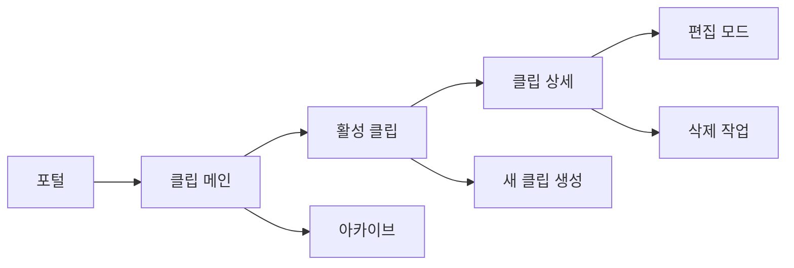
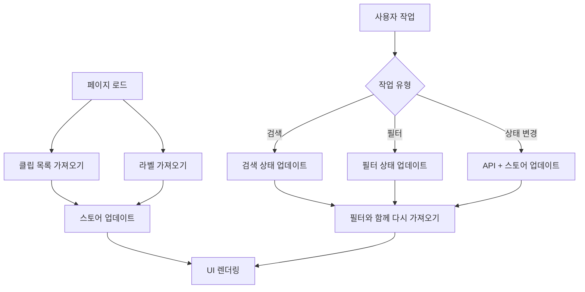

# 클립 페이지 분석

## 📍 페이지 개요
- **페이지 명**: 클립 관리 시스템
- **파일 위치**: `/Users/choihyunwon/github/hanway-front/src/pages/portal/clip/`
- **페이지 유형**: 동적 콘텐츠 관리 페이지
- **주요 목적**: 문서 및 콘텐츠에 대한 북마크 및 클립 관리
- **사용자 여정**: 포털 → 클립 → (아카이브/상세 보기)

## 🛤️ 라우터 구성
- **라우트 경로**: `/portal/clip`
- **하위 라우트**:
  - `/portal/clip/archive` - 아카이브된 클립 보기
  - `/portal/clip/:id` - 개별 클립 작업/상세
- **라우트 매개변수**: 클립 작업용 동적 `:id`
- **쿼리 매개변수**: 검색, 날짜 필터, 라벨
- **인증 필요**: 예 (포털 접근 권한 필요)

## 🏗️ 페이지 아키텍처
```
ClipPage
├── ResponsiveWrapper
│   ├── ClipMo (모바일)
│   │   ├── 헤더 섹션
│   │   │   ├── TabMenu (클립/아카이브)
│   │   │   ├── Search 컴포넌트
│   │   │   └── Filter 컴포넌트
│   │   └── 콘텐츠 영역
│   │       ├── Board (활성 클립)
│   │       └── Archive (아카이브된 클립)
│   └── ClipPc (데스크톱)
│       ├── 헤더 섹션
│       │   ├── TabMenu
│       │   ├── Search
│       │   └── Filter
│       └── 콘텐츠 영역
│           ├── Board
│           └── Archive
```

## 📦 컴포넌트 매핑
| 컴포넌트 | 위치 | 목적 | 주요 Props | 이벤트 |
|-----------|----------|---------|-----------|--------|
| ClipPage | `index.tsx` | 메인 래퍼 컴포넌트 | - | - |
| ClipMo/Pc | `clipMo/Pc.tsx` | 반응형 클립 인터페이스 | - | pathname 감지 |
| TabMenu | `component/tabMenu.tsx` | 탭 내비게이션 | currentPath | 탭 전환 |
| Search | `component/search.tsx` | 검색 및 날짜 필터링 | setStartDt, setEndDt, setSearchText | 검색 입력 |
| Filter | `component/filter.tsx` | 콘텐츠 필터링 옵션 | - | 필터 변경 |
| Board | `component/m/clip/board.tsx` | 클립 그리드/리스트 표시 | startDt, endDt, searchText | 클립 상호작용 |
| Archive | `component/pc/archive/archive.tsx` | 아카이브된 클립 보기 | - | 아카이브 관리 |
| Card | `component/m/clip/card.tsx` | 개별 클립 카드 | clip data | click, bookmark |
| ClipAutoSwipeZone | `component/m/clip/clipAutoSwipeZone.tsx` | 모바일 스와이프 상호작용 | - | 스와이프 제스처 |
| Status | `component/m/clip/status.tsx` | 클립 상태 표시기 | status data | 상태 변경 |
| ModalCardDetail | `component/modalCardDetail.tsx` | 클립 상세 모달 | clip details | close, actions |

## 🔄 데이터 흐름
- **데이터 소스**: 
  - `useGetClipStatusList` hook → 클립 목록 API
  - `useGetLabelList` hook → 라벨/카테고리 API
  - `useClipStore` → 글로벌 클립 상태
- **상태 관리**: 
  - 검색/필터 매개변수용 로컬 상태
  - 클립 관리를 위한 Zustand 스토어
  - API 캐싱을 위한 React Query
- **데이터 변환**: 
  - 날짜 필터링 (아카이브용 최근 7일)
  - 검색 텍스트 필터링
  - 상태 기반 범주화

## ⚡ 페이지 기능
- [x] CRUD 기능 (클립 생성, 읽기, 수정, 삭제)
- [x] 검색/필터링 (텍스트 검색, 날짜 범위, 라벨)
- [x] 정렬 (날짜, 상태, 우선순위별)
- [x] 모달/팝업 (상세 보기, 편집 폼)
- [x] 파일 업로드/다운로드 (첨부 파일)
- [x] 실시간 업데이트 (상태 변경)
- [ ] 페이지네이션 (무한 스크롤 구현됨)

## 🔌 API 연동
| 엔드포인트 | 메소드 | 목적 | 트리거 |
|----------|--------|---------|---------| 
| `/api/clip/status-list` | GET | 상태와 함께 클립 목록 가져오기 | 페이지 로드, 필터 변경 |
| `/api/clip/labels` | GET | 사용 가능한 라벨 가져오기 | 페이지 초기화 |
| `/api/clip/:id` | GET | 클립 상세 정보 가져오기 | 클립 카드 클릭 |
| `/api/clip/:id` | PUT | 클립 업데이트 | 편집 폼 제출 |
| `/api/clip/:id` | DELETE | 클립 삭제 | 삭제 작업 |
| `/api/clip` | POST | 새 클립 생성 | 생성 폼 제출 |

## 🎨 UI/UX 요소
- **레이아웃 유형**: 반응형 그리드/리스트 레이아웃
- **반응형 중단점**: 모바일/데스크톱 전환
- **로딩 상태**: 카드용 스켈레톤 로딩
- **에러 상태**: 클립이 없을 때 빈 상태
- **빈 상태**: 일러스트레이션과 함께 "클립을 찾을 수 없습니다"
- **애니메이션**: 카드 호버 효과, 스와이프 애니메이션
- **무한 스크롤**: 스크롤 시 더 많은 클립 로드
- **검색 하이라이트**: 결과에서 검색어 하이라이트

## 🔐 권한 및 보안
- **인증 필요**: 예 (포털 접근 권한)
- **역할 기반 접근**: 사용자별 클립
- **데이터 검증**: 클립 콘텐츠 검증
- **보안 기능**: 사용자 범위 데이터 접근

## 📱 내비게이션 흐름


## 🧩 컴포넌트 의존성
```
클립 의존성
├── 공유 컴포넌트
│   ├── ResponsiveWrapper
│   ├── HwScrollbar
│   └── UI 컴포넌트 (버튼, 입력)
├── 기능 컴포넌트
│   ├── TabMenu
│   ├── Search 컴포넌트
│   ├── Filter 컴포넌트
│   ├── Board/Archive 보기
│   └── Card 컴포넌트
├── Hooks
│   ├── useGetClipStatusList
│   ├── useGetLabelList
│   ├── useClipStore
│   └── useLocation (라우팅)
└── Services
    ├── clipService
    └── labelService
```

## ⚙️ 페이지 구성
- **기본 날짜 범위**: 아카이브용 최근 7일
- **자동 새로 고침**: 포커스 시 클립 목록 다시 가져오기
- **검색 디바운싱**: 검색 입력을 위한 300ms 지연
- **카드 레이아웃**: 데스크톱에서는 그리드, 모바일에서는 리스트
- **상태 색상**: 색상 코드된 상태 표시기

## 🔍 주요 사용자 상호작용
1. **탭 내비게이션**: 활성 클립과 아카이브 간 전환
2. **검색**: 클립 제목 및 콘텐츠 전반에 걸친 텍스트 검색
3. **날짜 필터링**: 시간 기반 필터링을 위한 날짜 범위 선택기
4. **라벨 필터링**: 다중 선택 라벨/카테고리 필터링
5. **카드 작업**: 상세 보기 클릭, 북마크 토글
6. **스와이프 제스처**: 빠른 작업을 위한 모바일 스와이프
7. **상태 관리**: 클립 상태 변경 (대기 중, 완료됨 등)
8. **일괄 작업**: 일괄 작업을 위한 다중 클립 선택
9. **새로 만들기**: 플로팅 액션 버튼을 통해 새 클립 추가
10. **아카이브 관리**: 클립을 아카이브로/에서 이동

## 📊 데이터 모델
- **ClipItem**: 개별 클립 데이터 구조
- **ClipStatus**: 상태 열거형 (대기, 활성, 완료, 아카이브)
- **LabelItem**: 라벨/카테고리 메타데이터
- **SearchFilter**: 검색 및 필터 매개변수
- **DateRange**: 시작/종료 날짜 필터링

## 🎯 기능 하이라이트
- **반응형 디자인**: 모바일 및 데스크톱 최적화
- **자동 아카이브**: 7일 자동 아카이브 기능
- **상태 추적**: 시각적 상태 표시기 및 워크플로
- **스마트 필터링**: 텍스트, 날짜 및 라벨 필터링 결합
- **터치 상호작용**: 모바일 최적화 스와이프 제스처
- **오프라인 기능**: 빠른 접근을 위한 로컬 저장소
- **실시간 업데이트**: 라이브 상태 동기화

## 🔄 상태 관리 흐름
