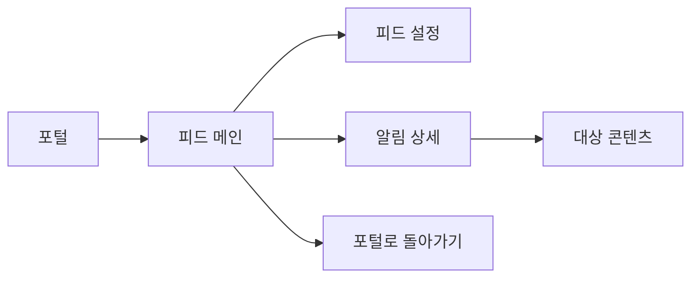
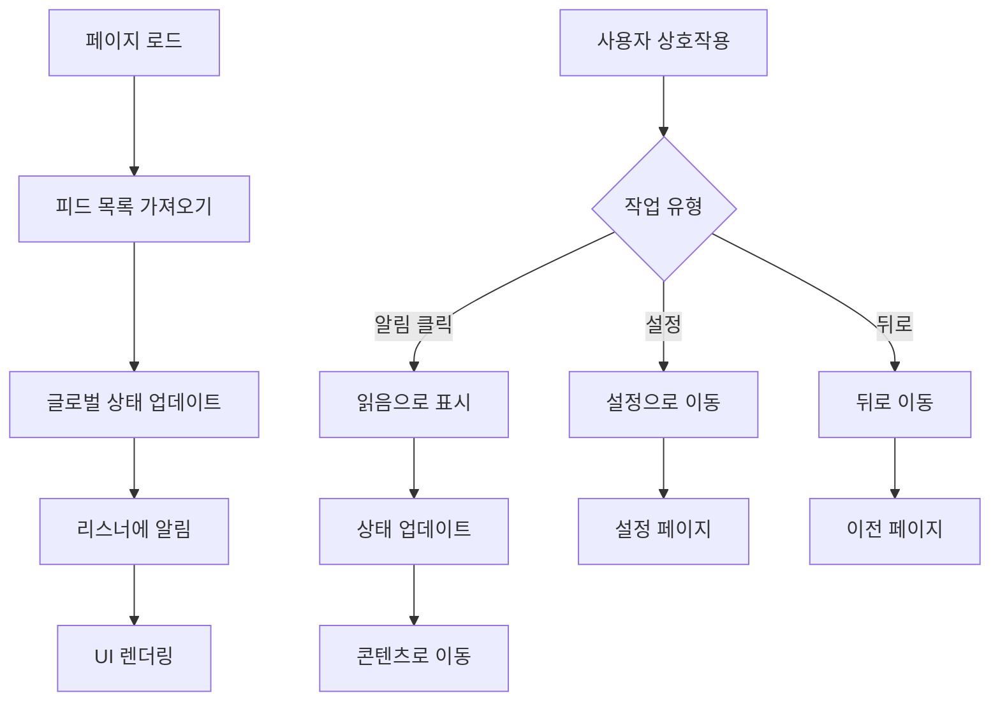

# 피드 페이지 분석

## 📍 페이지 개요
- **페이지 명**: 뉴스 피드
- **파일 위치**: `/Users/choihyunwon/github/hanway-front/src/pages/portal/feed/`
- **페이지 유형**: 실시간 알림 및 뉴스 피드
- **주요 목적**: 알림, 공지사항 및 뉴스 업데이트 표시
- **사용자 여정**: 포털 → 피드 → 설정/상세 보기

## 🛤️ 라우터 구성
- **라우트 경로**: `/portal/feed`
- **하위 라우트**: 없음 (단일 페이지 애플리케이션)
- **라우트 매개변수**: 없음
- **쿼리 매개변수**: 없음
- **인증 필요**: 예 (포털 접근 권한 필요)
- **관련 라우트**: 피드 설정을 위한 `/portal/setting/feed`

## 🏗️ 페이지 아키텍처
```
FeedPage
├── ResponsiveWrapper
│   ├── FeedMo (모바일)
│   │   ├── 헤더 섹션
│   │   │   ├── 뒤로 내비게이션
│   │   │   ├── 제목
│   │   │   └── 설정 아이콘
│   │   └── 콘텐츠 영역
│   │       ├── 빈 상태 (피드 없음)
│   │       └── 피드 목록
│   │           └── 피드 항목
│   └── FeedPc (데스크톱)
│       └── [모바일과 유사한 구조]
```

## 📦 컴포넌트 매핑
| 컴포넌트 | 위치 | 목적 | 주요 Props | 이벤트 |
|-----------|----------|---------|-----------|--------|
| FeedPage | `index.tsx` | 메인 래퍼 컴포넌트 | - | - |
| FeedMo | `feedMo.tsx` | 모바일 피드 인터페이스 | - | navigation, settings |
| FeedPc | `feedPc.tsx` | 데스크톱 피드 인터페이스 | - | navigation, settings |
| Feed Items | FeedMo/Pc에 임베드 | 개별 알림 카드 | feed data | click, mark as read |
| Empty State | 임베드됨 | 알림 없음 표시 | - | - |

## 🔄 데이터 흐름
- **데이터 소스**: 
  - `useFeedList` hook → 피드 API
  - `useFeed` hook → 글로벌 피드 상태 관리
  - 컴포넌트 간 글로벌 상태 동기화
- **상태 관리**: 
  - 사용자 정의 hook을 통한 글로벌 피드 상태
  - 상태 동기화를 위한 리스너 패턴
  - 로컬 팝오버 상태 관리
- **데이터 변환**: 
  - dayjs를 통한 날짜 형식 지정
  - 서비스별 알림 그룹화
  - 읽음/읽지 않음 상태 관리

## ⚡ 페이지 기능
- [x] 실시간 업데이트 (실시간 피드 업데이트)
- [x] CRUD 기능 (알림 읽기, 읽음으로 표시)
- [x] 정렬 (날짜별, 시간순)
- [ ] 검색/필터링
- [ ] 페이지네이션
- [ ] 파일 업로드/다운로드
- [x] 모달/팝업 (피드 상세 내비게이션)

## 🔌 API 연동
| 엔드포인트 | 메소드 | 목적 | 트리거 |
|----------|--------|---------|---------| 
| `/api/feed` | GET | 알림 피드 가져오기 | 페이지 로드, 새로 고침 |
| `/api/feed/:id/read` | PUT | 알림을 읽음으로 표시 | 알림 클릭 |
| `/api/feed/settings` | GET/PUT | 피드 환경설정 | 설정 페이지 |

## 🎨 UI/UX 요소
- **레이아웃 유형**: 세로 카드 리스트 레이아웃
- **반응형 중단점**: 모바일/데스크톱 전환
- **로딩 상태**: 초기 피드 로딩
- **에러 상태**: 네트워크 에러 처리
- **빈 상태**: 메시지와 함께 알림 없음 일러스트레이션
- **애니메이션**: 카드 호버 효과, 부드러운 전환
- **상태 표시기**: 읽음/읽지 않음 시각적 표시기
- **타이포그래피 계층**: 서비스명, 제목, 메타데이터

## 🔐 권한 및 보안
- **인증 필요**: 예 (포털 접근 권한)
- **역할 기반 접근**: 직원별 알림
- **데이터 검증**: 알림 ID 검증
- **보안 기능**: 직원 ID 범위 피드 데이터

## 📱 내비게이션 흐름


## 🧩 컴포넌트 의존성
```
피드 의존성
├── 공유 컴포넌트
│   ├── ResponsiveWrapper
│   ├── HwText
│   ├── 아이콘 (ArrowLeft, Setting, InfoCircle)
│   └── Flex Layout (Chakra UI)
├── 기능 컴포넌트
│   └── 피드 항목 카드
├── Hooks
│   ├── useFeed (글로벌 상태)
│   ├── useFeedList (API)
│   ├── useTranslation
│   └── useNavigate
├── Services
│   └── feedService
└── 유틸리티
    └── dayjs (날짜 형식 지정)
```

## ⚙️ 페이지 구성
- **직원 ID**: 데모용 하드코딩 (`M202505291146000635`)
- **날짜 형식**: `YYYY.MM.DD`
- **자동 새로 고침**: 수동 새로 고침 기능
- **최대 항목**: 페이지네이션 제한 없음
- **카드 스타일링**: 디자인 시스템과 일관성

## 🔍 주요 사용자 상호작용
1. **피드 보기**: 알림 목록 스크롤
2. **내비게이션**: 이전 페이지로 돌아가는 버튼
3. **설정 접근**: 헤더의 빠른 설정 아이콘
4. **알림 클릭**: 대상 콘텐츠로 이동
5. **읽음으로 표시**: 알림 클릭 시 자동
6. **빈 상태**: 알림이 없을 때 정보성 메시지
7. **새로 고침**: 당겨서 새로 고침 또는 수동 새로 고침
8. **서비스 필터링**: 서비스 유형별로 그룹화된 알림

## 📊 데이터 모델
- **FeedResponse**: 알림 데이터 구조
  - `notificationId`: 고유 식별자
  - `alarmServiceNm`: 서비스명
  - `alarmTitle`: 알림 제목
  - `makerNm`: 작성자명
  - `makeDay`: 생성 날짜
  - `docCtnsUrl`: 대상 URL
  - `isRead`: 읽음 상태

## 🎯 기능 하이라이트
- **글로벌 상태 관리**: 사용자 정의 hook 기반 상태 공유
- **리스너 패턴**: 컴포넌트 간 실시간 업데이트
- **반응형 디자인**: 모바일 우선 접근법
- **빈 상태 디자인**: 사용자 친화적인 콘텐츠 없음 메시지
- **내비게이션 통합**: 콘텐츠에 대한 원활한 라우팅
- **설정 통합**: 피드 환경설정에 직접 접근
- **날짜 처리**: 일관된 날짜 형식 지정

## 🔄 상태 관리 흐름


## 🌟 사용자 경험 기능
- **즉시 피드백**: 상호작용에 대한 시각적 피드백
- **컨텍스트 내비게이션**: 스마트 뒤로 내비게이션
- **서비스 분류**: 명확한 서비스 유형 식별
- **읽음 상태**: 읽음/읽지 않음 간 시각적 구분
- **터치 최적화**: 모바일 친화적인 터치 대상
- **로딩 상태**: 부드러운 로딩 전환
- **에러 처리**: 우아한 에러 상태 관리

## 📈 성능 고려사항
- **쿼리 캐싱**: API 응답 캐싱을 위한 React Query
- **상태 최적화**: 리스너 패턴으로 최소 리렌더링
- **메모리 관리**: 이벤트 리스너의 적절한 정리
- **이미지 최적화**: 효율적인 아이콘 렌더링
- **번들 크기**: 피드 기능을 위한 최소 의존성