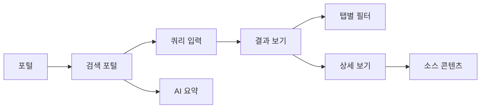
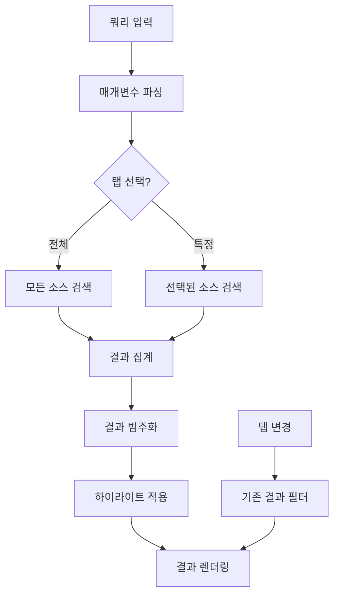

# 검색 포털 페이지 분석

## 📍 페이지 개요
- **페이지 명**: 검색 포털
- **파일 위치**: `/Users/choihyunwon/github/hanway-front/src/pages/portal/searchPortal/`
- **페이지 유형**: 통합 검색 인터페이스
- **주요 목적**: 다중 데이터 소스 및 서비스 전반의 통합 검색
- **사용자 여정**: 포털 → 검색 → 결과 → 상세 보기

## 🛤️ 라우터 구성
- **라우트 경로**: `/search`
- **라우트 매개변수**: 없음
- **쿼리 매개변수**: 
  - `q` - 검색 쿼리
  - `tab` - 활성 탭 (all, electronicApproval, hanBoard, googleDrive, staffExecutives, gmail)
- **인증 필요**: 예 (포털 접근 권한 필요)
- **서브 사이드바**: 검색 인터페이스용으로 활성화됨

## 🏗️ 페이지 아키텍처
```
SearchPortal
├── 검색 헤더
│   ├── SearchForm 컴포넌트
│   └── AI 요약 섹션
│       ├── AI 아이콘 & 제목
│       ├── 툴팁 정보
│       └── 요약 콘텐츠 박스
└── 탭 결과
    ├── 전체 탭
    ├── 전자결재 탭
    ├── 한보드 탭
    ├── 구글드라이브 탭
    ├── 임직원 탭
    └── Gmail 탭
```

## 📦 컴포넌트 매핑
| 컴포넌트 | 위치 | 목적 | 주요 Props | 이벤트 |
|-----------|----------|---------|-----------|--------|
| SearchFo | `index.tsx` | 메인 검색 인터페이스 | - | 탭 전환, 검색 |
| SearchForm | `@/components/hwSearch` | 검색 입력 컴포넌트 | - | 쿼리 제출 |
| SearchContentRenderer | `searchContentRenderer.tsx` | 결과 표시 | data, searchText, category | 내비게이션 |
| SearchEmptyState | `searchEmptyState.tsx` | 결과 없음 표시 | - | - |
| HwTabs | `@/components/uiKit/hwTabs` | 탭 내비게이션 | tabs, fullWidth | 탭 선택 |
| TextHighlight | `textHighlight.tsx` | 검색어 하이라이트 | text, searchText | - |
| SearchValue | `searchValue.tsx` | 검색 입력 처리 | - | 값 변경 |

## 🔄 데이터 흐름
- **데이터 소스**: 
  - `useSearch` hook → 검색 API
  - `useSearchData` hook → 로컬 데이터 필터링
  - 쿼리 상태를 위한 URL 검색 매개변수
- **상태 관리**: 
  - URL 기반 상태 (쿼리, 탭)
  - API 캐싱을 위한 React Query
  - 로컬 검색 데이터 처리
- **데이터 변환**: 
  - 검색 결과 범주화
  - 검색어를 위한 텍스트 하이라이트
  - 결과 개수 집계

## ⚡ 페이지 기능
- [x] 검색/필터링 (다중 소스 검색)
- [x] 정렬 (관련성, 날짜별)
- [x] 모달/팝업 (AI 요약 툴팁)
- [x] 실시간 업데이트 (검색 제안)
- [ ] CRUD 기능
- [ ] 페이지네이션
- [ ] 파일 업로드/다운로드

## 🔌 API 연동
| 엔드포인트 | 메소드 | 목적 | 트리거 |
|----------|--------|---------|---------| 
| `/api/search` | POST | 통합 검색 쿼리 | 검색 폼 제출 |
| `/api/search/detail` | POST | 상세 검색 결과 | 결과 항목 클릭 |
| 다중 데이터 소스 | GET | 소스별 검색 | 탭 필터링된 검색 |

## 🎨 UI/UX 요소
- **레이아웃 유형**: 탭 결과가 있는 중앙 검색 인터페이스
- **반응형 중단점**: 모바일/데스크톱 레이아웃 전환
- **로딩 상태**: 검색 결과 로딩
- **에러 상태**: 결과를 찾을 수 없음
- **빈 상태**: 초기 검색 프롬프트
- **애니메이션**: 탭 전환, 결과 하이라이트
- **AI 통합**: AI 기반 검색 요약
- **검색 하이라이트**: 결과에서 쿼리 용어 하이라이트

## 🔐 권한 및 보안
- **인증 필요**: 예 (포털 접근 권한)
- **역할 기반 접근**: 소스별 접근 제어
- **데이터 검증**: 쿼리 살균
- **보안 기능**: 교차 소스 권한 확인

## 📱 내비게이션 흐름


## 🧩 컴포넌트 의존성
```
검색 포털 의존성
├── 공유 컴포넌트
│   ├── HwScrollbar
│   ├── HwTabs
│   ├── SearchForm
│   ├── HwText, HwTooltipTile
│   └── Chakra UI Layout
├── 기능 컴포넌트
│   ├── SearchContentRenderer
│   ├── SearchEmptyState
│   ├── TextHighlight
│   └── SearchValue
├── Hooks
│   ├── useSearch
│   ├── useSearchData
│   ├── useSearchParams
│   ├── useSidebarStore
│   └── useTranslation
└── Services
    └── searchService
```

## ⚙️ 페이지 구성
- **기본 탭**: 'all' (전체 결과)
- **검색 소스**: 
  - 전자결재
  - 한보드
  - 구글드라이브
  - 임직원
  - Gmail
- **AI 요약**: 툴팁 도움말과 함께 활성화
- **서브 사이드바**: 페이지 로드 시 자동 활성화
- **결과 하이라이트**: 자동 쿼리 용어 하이라이트

## 🔍 주요 사용자 상호작용
1. **검색 쿼리**: 메인 검색 폼에 검색어 입력
2. **탭 내비게이션**: 다른 데이터 소스 간 전환
3. **결과 내비게이션**: 결과를 클릭하여 소스 콘텐츠 보기
4. **AI 요약**: AI 생성 검색 인사이트 보기
5. **툴팁 도움말**: AI 요약 설명을 위한 호버
6. **URL 공유**: URL을 통한 검색 결과 공유
7. **쿼리 개선**: 검색어 수정
8. **소스 필터링**: 특정 데이터 소스별 필터

## 📊 데이터 모델
- **ISearchReq**: 검색 요청 매개변수
  - `query`: 검색어
  - `data_store_specs`: 소스 사양 배열
- **ISearchRes**: 검색 응답 구조
- **ISearchResultItem**: 개별 검색 결과
  - `title`: 결과 제목
  - `content`: 결과 콘텐츠
  - `category`: 소스 카테고리
  - `team`: 연관된 팀/부서

## 🎯 검색 카테고리
1. **전체**: 모든 소스의 집계된 결과
2. **전자결재**: 결재 문서 및 워크플로
3. **한보드**: 게시판 게시물 및 공지사항  
4. **구글드라이브**: 파일 및 문서 검색
5. **임직원**: 직원 디렉토리 검색
6. **Gmail**: 이메일 검색 통합

## 🤖 AI 통합
- **AI 요약 섹션**: 컨텍스트적 검색 인사이트
- **요약 콘텐츠**: 
  - 검색 결과의 주요 발견사항
  - 제안된 개선사항
  - 관련 주제
- **툴팁 도움말**: AI 요약 기능 설명
- **시각적 표시기**: AI 브랜딩 및 아이콘

## 🔄 검색 흐름


## 🌟 고급 기능
- **교차 소스 검색**: 다중 시스템 전반의 통합 검색
- **쿼리 지속성**: URL 기반 쿼리 상태 관리
- **결과 하이라이트**: 동적 텍스트 하이라이트
- **AI 향상 결과**: AI 생성 요약 및 인사이트
- **반응형 탭**: 모바일 최적화 탭 내비게이션
- **실시간 필터링**: 즉시 탭 기반 필터링
- **딥 링킹**: 검색 결과에 대한 직접 링크

## 📈 성능 최적화
- **쿼리 디바운싱**: 최적화된 검색 API 호출
- **결과 캐싱**: React Query 캐싱 전략
- **지연 로딩**: 요청 시 탭 콘텐츠 로드
- **메모화**: 최적화된 결과 처리
- **효율적인 하이라이트**: 최적화된 텍스트 하이라이트 알고리즘

## 🔍 검색 데이터 처리
- **텍스트 필터링**: 대소문자 구분 없는 검색 매칭
- **카테고리 필터링**: 소스별 결과 필터링
- **결과 카운팅**: 카테고리당 동적 결과 개수
- **관련성 스코어링**: 관련성별 결과 랭킹
- **중복 처리**: 교차 소스 중복 감지