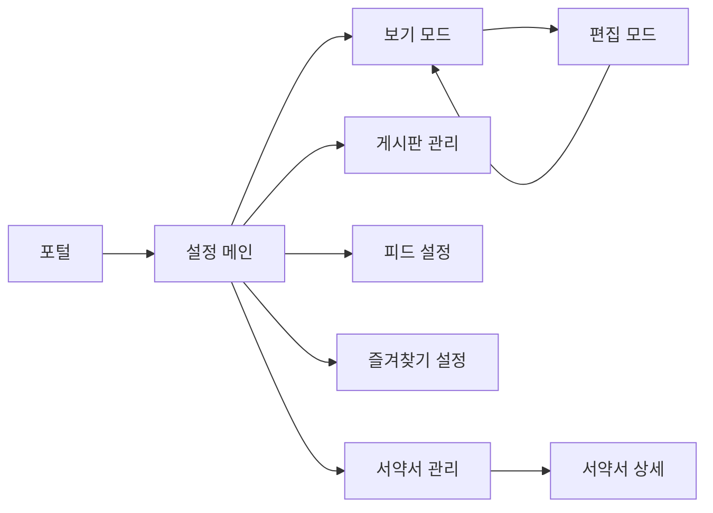

# 설정 페이지 분석

## 📍 페이지 개요
- **페이지 명**: 포털 설정
- **파일 위치**: `/Users/choihyunwon/github/hanway-front/src/pages/portal/settings/`
- **페이지 유형**: 다중 섹션 설정 페이지
- **주요 목적**: 사용자 프로필 및 시스템 설정 관리
- **사용자 여정**: 포털 → 설정 (다양한 하위 섹션)

## 🛤️ 라우터 구성
- **라우트 경로**: `/portal/setting`
- **하위 라우트**:
  - `/portal/setting/basic-information` - 기본 정보 관리
  - `/portal/setting/basic-information/edit` - 기본 정보 편집
  - `/portal/setting/feed` - 피드 설정
  - `/portal/setting/favorite` - 즐겨찾기 설정
  - `/portal/setting/board` - 게시판 관리
  - `/portal/setting/pledge` - 서약서 관리
  - `/portal/setting/pledge/:id` - 서약서 상세
- **라우트 매개변수**: 서약서 상세를 위한 동적 `:id`
- **인증 필요**: 예 (포털 접근 권한 필요)

## 🏗️ 페이지 아키텍처
```
설정
├── 기본 정보 섹션
│   ├── BasicInfoViewPc/Mo
│   ├── 편집 모드 (BasicInfoEditPc/Mo)
│   ├── ProfileSection
│   ├── InfoRow 컴포넌트
│   └── EmailList 관리
├── 게시판 관리 섹션
│   ├── BoardManagerPc/Mo
│   ├── BoardList
│   ├── 설정 폼
│   └── 권한 모델
├── 피드 설정 섹션
│   └── FeedSettingsPc/Mo
├── 즐겨찾기 설정 섹션
│   └── FavoriteSettingsPc/Mo
└── 서약서 관리 섹션
    ├── PledgeManagement
    ├── PledgeDetail
    └── SignatureEmployeeList
```

## 📦 컴포넌트 매핑
| 컴포넌트 | 위치 | 목적 | 주요 Props | 이벤트 |
|-----------|----------|---------|-----------|--------|
| BasicInfoView | `basicInformation/index.tsx` | 메인 프로필 보기 래퍼 | formData, onEditProfile | handleEditProfile, handleGoBack |
| BasicInfoViewPc/Mo | `basicInformation/basicInfoPc/Mo.tsx` | 반응형 프로필 표시 | formData, onEditProfile | - |
| ProfileSection | `basicInformation/profileSection.tsx` | 프로필 이미지 및 기본 정보 | user data | avatar upload |
| InfoRow | `basicInformation/infoRow.tsx` | 개별 정보 필드 표시 | label, value, type | - |
| EmailList | `basicInformation/emailList.tsx` | 이메일 관리 | emails, selectedEmail | add, remove, select |
| BoardManagerPc/Mo | `boardManager/boardManagerPc/Mo.tsx` | 게시판 설정 인터페이스 | - | form submissions |
| BasicSettingsForm | `boardManager/basicSettingsForm.tsx` | 게시판 기본 설정 | board config | save settings |
| AdvancedSettingsForm | `boardManager/advancedSettingsForm.tsx` | 게시판 고급 설정 | permissions | permission updates |
| UserDetailPermissionModal | `boardManager/userDetailPermissionModal.tsx` | 사용자 권한 상세 | user, permissions | permission changes |

## 🔄 데이터 흐름
- **데이터 소스**: 
  - `useBasicInformation` hook → 기본 정보 API
  - `useAuthStore` → 현재 사용자 컨텍스트
  - `react-hook-form`을 통한 폼 상태 관리
- **상태 관리**: 
  - React Hook Form을 통한 로컬 폼 상태
  - Zustand를 통한 글로벌 인증 상태
  - React Query를 통한 쿼리 캐시
- **데이터 변환**: 
  - 전화번호 파싱/형식 지정
  - 이메일 목록 관리
  - 날짜 형식 지정 (YYYY.MM.DD)
  - 파일 업로드 처리

## ⚡ 페이지 기능
- [x] CRUD 기능 (프로필 정보 업데이트)
- [x] 파일 업로드/다운로드 (프로필 이미지)
- [x] 폼 처리 (프로필 편집)
- [x] 모달/팝업 (권한 모델)
- [x] 검색/필터링 (게시판 설정)
- [ ] 페이지네이션
- [ ] 정렬
- [ ] 실시간 업데이트

## 🔌 API 연동
| 엔드포인트 | 메소드 | 목적 | 트리거 |
|----------|--------|---------|---------| 
| `/api/basic-info` | GET | 사용자 기본 정보 조회 | 페이지 로드 |
| `/api/basic-info` | PUT | 사용자 기본 정보 업데이트 | 폼 제출 |
| `/api/upload/multipart` | POST | 프로필 이미지 업로드 | 파일 선택 |
| `/api/board-settings` | GET/PUT | 게시판 관리 | 게시판 설정 페이지 |
| `/api/feed-settings` | GET/PUT | 피드 환경설정 | 피드 설정 페이지 |

## 🎨 UI/UX 요소
- **레이아웃 유형**: 반응형 래퍼 (PC/모바일 변형)
- **반응형 중단점**: 모바일/데스크톱 전환
- **로딩 상태**: 폼 제출 로딩
- **에러 상태**: 폼 검증 에러
- **빈 상태**: 이메일 주소 없음
- **폼 검증**: 이메일 형식, 전화번호 형식
- **파일 업로드**: 미리보기가 있는 프로필 이미지

## 🔐 권한 및 보안
- **인증 필요**: 예 (포털 접근 권한)
- **역할 기반 접근**: 직원 전용 데이터
- **데이터 검증**: 
  - 이메일 형식 검증
  - 전화번호 형식 검증
  - 업로드 파일 유형 검증
- **보안 기능**: 직원 ID 기반 데이터 접근

## 📱 내비게이션 흐름


## 🧩 컴포넌트 의존성
```
설정 의존성
├── 공유 컴포넌트
│   ├── ResponsiveWrapper
│   ├── HwText, HwButton
│   └── Form Components
├── 기능 컴포넌트
│   ├── ProfileSection
│   ├── EmailList
│   ├── InfoRow
│   └── Various Settings Forms
├── Hooks
│   ├── useBasicInformation
│   ├── useUpdateBasicInformation
│   ├── useAuthStore
│   └── useNotify
└── Services
    ├── basicInformationService
    └── uploadService
```

## ⚙️ 페이지 구성
- **폼 검증**: 사용자 정의 검증기가 있는 React Hook Form
- **파일 업로드**: 프로필 이미지용 멀티파트 업로드
- **국제화**: 다국어 지원을 위한 i18n 지원
- **날짜 처리**: 날짜 형식 지정을 위한 dayjs
- **전화번호**: 국제 전화번호 처리를 위한 libphonenumber-js

## 🔍 주요 사용자 상호작용
1. **프로필 보기**: 사용자 기본 정보 표시
2. **프로필 편집**: 폼 검증을 통한 현재 위치 편집
3. **아바타 업로드**: 드래그 앤 드롭 또는 클릭하여 프로필 이미지 업로드
4. **이메일 관리**: 기본 이메일 추가, 제거, 설정
5. **전화번호**: 국가 코드 선택이 가능한 국제 형식
6. **개인정보 설정**: 정보 공개 제어
7. **근무 시간**: 근무 시작/종료 시간 설정
8. **게시판 관리**: 게시판 권한 및 설정 구성
9. **피드 환경설정**: 알림 설정 사용자 정의
10. **서약서 관리**: 약속 서약서 보기 및 관리

## 📊 데이터 모델
- **BasicInfo**: 직원 프로필 데이터 구조
- **EmailList**: 회사 이메일 주소 배열
- **AttachFile**: 파일 업로드 메타데이터
- **PhoneNumber**: 국제 전화번호 형식
- **PrivacySettings**: 정보 공개 환경설정
- **WorkingHours**: 근무 시간 구성