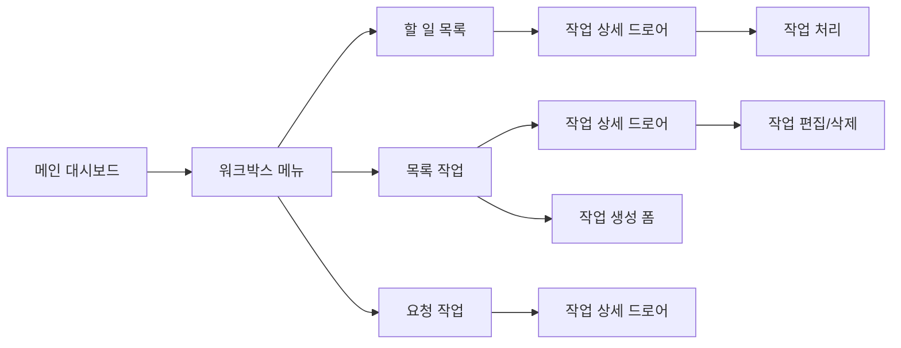

# 워크박스 페이지 분석

## 1. 라우터 구성
- **기본 경로**: `/workbox`
- **하위 라우트**:
  - **할 일 목록**: `/workbox/workbox-todo-list` - 해야 할 업무
  - **목록 작업**: `/workbox/workbox-list-task` - 증명서 발급처리  
  - **요청 작업**: `/workbox/workbox-requested-list` - 요청 업무
- **라우트 매개변수**: 필터링을 위한 쿼리 매개변수 (`filterBy=new|progress|delay|complete`)
- **내비게이션 가드**: FO 레이아웃을 통한 인증 필요
- **부모/자식 라우트**: 사이드바 내비게이션이 있는 메인 워크박스 라우트 하위에 중첩됨

## 2. 페이지 개요
- **페이지 명**: 
  - 할 일 목록 (할 일 목록)
  - 목록 작업 (업무 목록) 
  - 요청 작업 (요청된 업무)
- **파일 위치**:
  - `/src/pages/workbox/toDoList/index.tsx`
  - `/src/pages/workbox/listTask/index.tsx`
  - `/src/pages/workbox/requestedTask/index.tsx`
- **페이지 유형**: 반응형 래퍼가 있는 동적 페이지
- **주요 목적**: 다양한 작업 항목 처리를 위한 작업 및 워크박스 관리 시스템
- **사용자 여정**: 메인 → 워크박스 → 특정 작업 유형 → 상세/폼

## 3. 페이지 아키텍처
```
워크박스 페이지
├── ToDoList 페이지
│   ├── 검색 폼 (날짜 범위 + 텍스트 + 관리자 선택)
│   ├── HwTable (페이지네이션이 있는 작업 목록)
│   └── 작업 상세 드로어 (WorkboxItemDetail 통해)
├── ListTask 페이지  
│   ├── 반응형 래퍼
│   │   ├── 모바일 버전 (ListTaskPageMo)
│   │   └── 데스크톱 버전 (ListTaskPagePc)
│   ├── 검색 바 컴포넌트
│   ├── CRUD 작업이 있는 테이블
│   ├── 생성 폼 드로어
│   └── 상세 보기 드로어
└── RequestedTask 페이지
    ├── 검색 폼 (날짜 범위 + 텍스트 + 관리자 선택)
    ├── HwTable (ToDoList와 유사)
    └── 작업 상세 드로어
```

## 4. 컴포넌트 매핑
| 컴포넌트 | 위치 | 목적 | Props | 이벤트 |
|-----------|----------|---------|-------|--------|
| ResponsiveWrapper | `/components/responsiveWrapper` | 모바일/데스크톱 라우팅 | mobileComponent, desktopComponent | - |
| HwTable | `/components/hwTable` | 데이터 표시 | columns, data, pagination | onPageChange, onSelectedRowsChange |
| StatusBadge | `./statusBadge.tsx` | 상태 시각화 | status, paddingX, paddingY | - |
| WorkboxItemDetail | `./details/index.tsx` | 작업 상세 보기 | workboxType | - |
| HwDateInput | `/components/hwDatePicker` | 날짜 선택 | hookFormed, name | onChange |
| UserSettingPermission | `/pages/mgr/common/permissionSettingModal` | 관리자 선택 | onClose | onSelectManager |

## 5. 데이터 흐름
- **데이터 소스**: 모의 데이터 (mockTodoData, mockListTaskData), 워크박스 스토어
- **상태 관리**: Zustand 스토어 (`useWorkboxStore`), 폼을 위한 React Hook Form
- **데이터 변환**: 페이지네이션 유틸리티, 상태/카테고리별 필터링
- **데이터 종속성**: 필터링을 위한 URL 매개변수, 사이드바에서 선택된 카테고리

## 6. 페이지 기능
- [x] CRUD 기능 (생성/읽기/수정/삭제) - 완전한 작업 관리
- [x] 검색/필터링 - 날짜 범위, 텍스트 검색, 관리자 선택
- [x] 페이지네이션 - 페이지 크기 제어가 있는 테이블 페이지네이션
- [x] 정렬 - 테이블에서 열 정렬
- [ ] 파일 업로드/다운로드
- [x] 실시간 업데이트 - URL 매개변수 리스닝
- [x] 폼 처리 - Yup 검증이 있는 React Hook Form
- [x] 모달/팝업 - 상세/폼용 드로어, 관리자 선택용 모달

## 7. API 통합
| 엔드포인트 | 메소드 | 목적 | 트리거 |
|----------|--------|---------|---------| 
| 모의 데이터만 | - | 현재 모의 데이터 사용 중 | 페이지 로드/검색 |
| *향후 API 엔드포인트* | GET/POST/PUT/DELETE | 작업 CRUD 작업 | 사용자 작업 |

## 8. UI/UX 요소
- **레이아웃 유형**: 모바일/데스크톱 변형이 있는 반응형
- **반응형 중단점**: ResponsiveWrapper 컴포넌트에서 처리
- **로딩 상태**: 명시적으로 구현되지 않음 (모의 데이터 사용)
- **에러 상태**: Yup 스키마를 통한 폼 검증 에러
- **빈 상태**: 테이블에서 빈 데이터 표시 처리
- **애니메이션**: 클릭 가능한 항목의 호버 효과

## 9. 권한 및 보안
- **인증 필요**: 예 (FO 레이아웃 보호)
- **역할 기반 접근**: 사이드바 내비게이션에서 가시성 제어
- **데이터 검증**: 폼 검증을 위한 Yup 스키마
- **보안 기능**: 적절한 텍스트 렌더링을 통한 XSS 방지

## 10. 내비게이션 흐름


## 11. 컴포넌트 의존성
```
워크박스 의존성
├── 공유 컴포넌트
│   ├── ResponsiveWrapper
│   ├── HwTable
│   ├── HwText, HwButton, HwInput
│   └── HwDateInput, HwSelect2
├── 기능 컴포넌트
│   ├── StatusBadge
│   ├── WorkboxItemDetail
│   ├── WorkboxProcessItem
│   └── WorkboxCommentInput
├── 스토어 통합
│   └── useWorkboxStore (Zustand)
└── 폼 컴포넌트
    ├── React Hook Form
    ├── Yup 검증
    └── UserSettingPermission 모달
```

## 12. 페이지 구성
- **환경 변수**: 워크박스에 특정한 것 없음
- **구성 파일**: `/routers/workbox/`의 라우터 구성
- **상수**: 상태 열거형, 검색 유형, 워크박스 상태
- **기본 값**: 페이지 크기 (10), 빈 폼 상태

## 주요 구현 참고 사항

### 데이터 관리
- 현재 모든 페이지가 API 통합 계획과 함께 모의 데이터 사용
- 사용자 정의 유틸리티 함수를 통해 페이지네이션 처리
- 상태 기반 보기를 위한 URL 매개변수 필터링

### 반응형 디자인
- 모바일 및 데스크톱 컴포넌트는 별도 구현
- 모바일은 카드 기반 레이아웃, 데스크톱은 테이블 레이아웃 사용
- 각 중단점에 대한 다른 상호작용 패턴

### 상태 관리
- Zustand 스토어가 페이지 간 워크박스 상태 관리
- 개별 페이지 폼 상태를 위한 React Hook Form
- 지속적인 필터 상태를 위한 URL 매개변수

### 사용자 경험
- 원활한 내비게이션을 위한 드로어 기반 상세 보기
- 작업 완료 상태를 위한 진행률 표시기
- 빠른 식별을 위한 색상 코딩이 있는 상태 배지
- 전용 모달 인터페이스를 통한 관리자 선택

### 향후 개선 사항
- 모의 데이터를 대체하기 위한 API 통합
- 협업 작업을 위한 실시간 업데이트
- 파일 첨부 지원
- 고급 필터링 및 정렬 옵션
- 작업 관리를 위한 일괄 작업